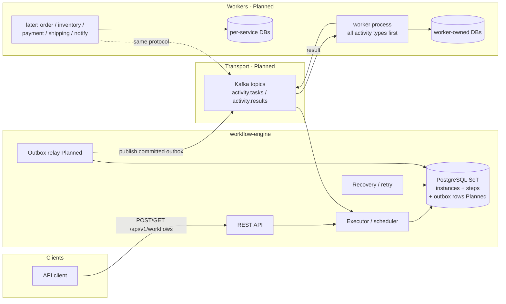
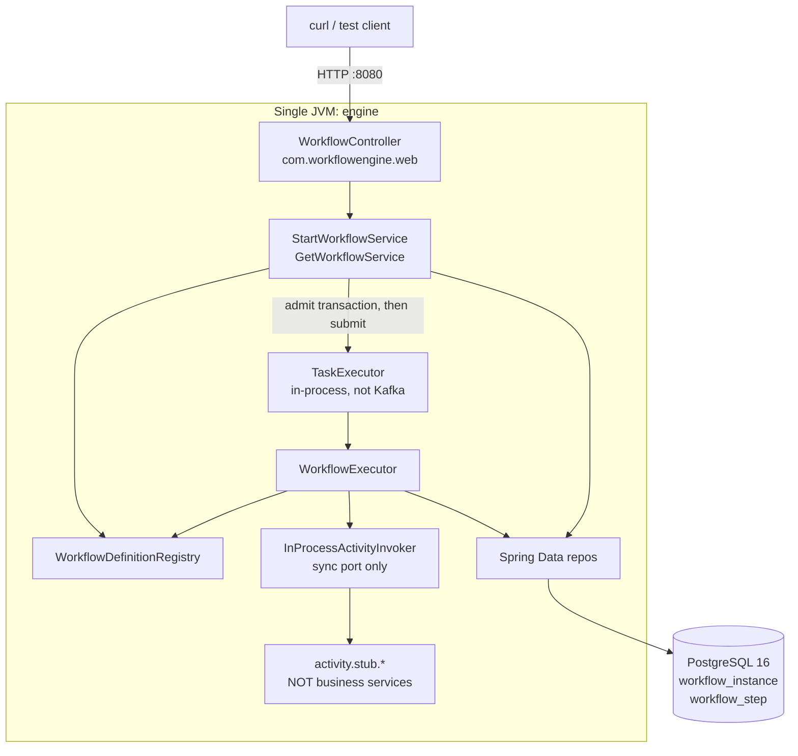
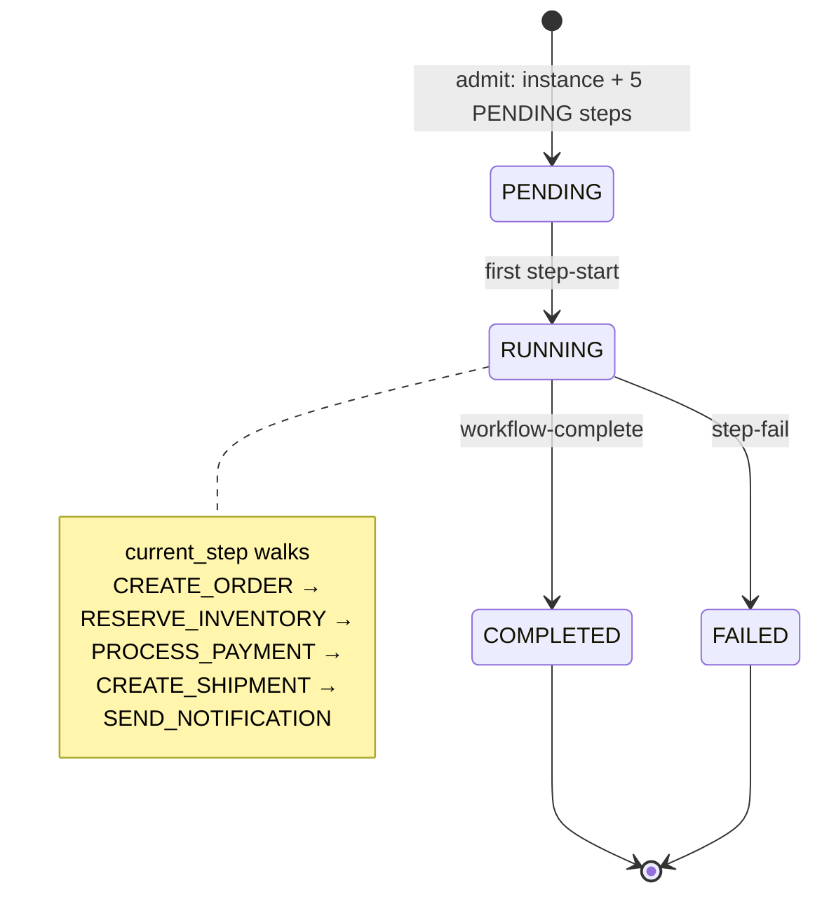
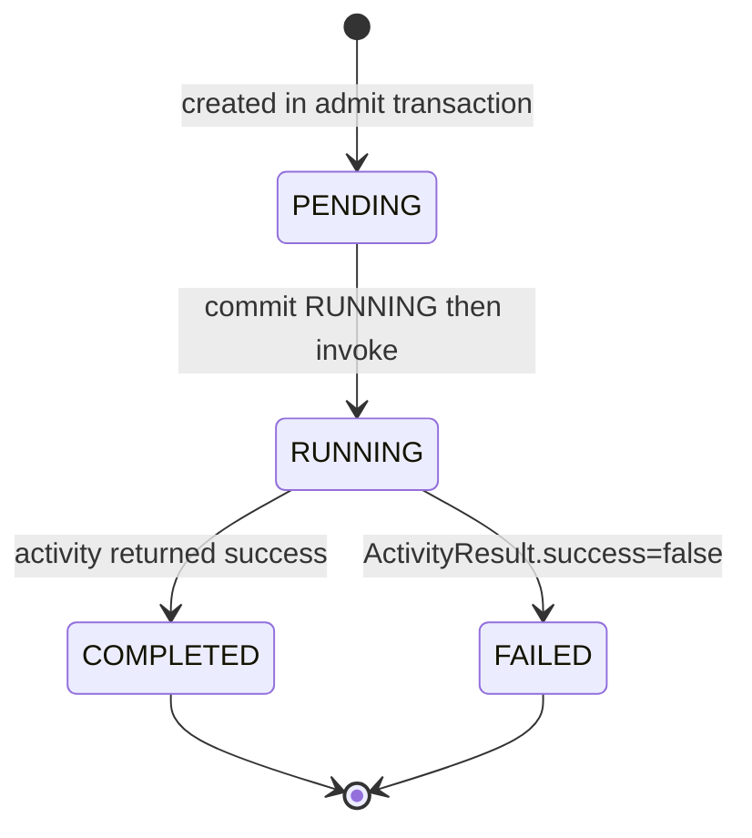
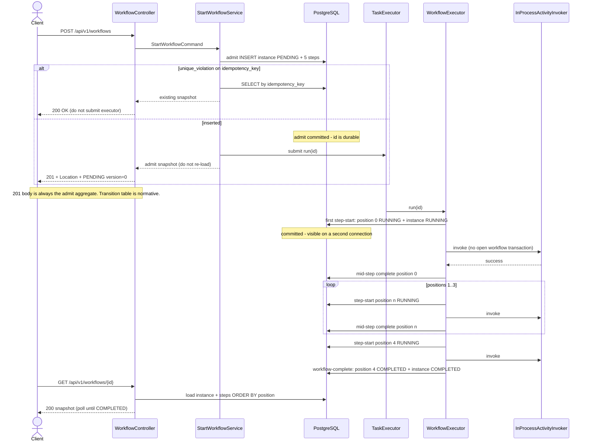
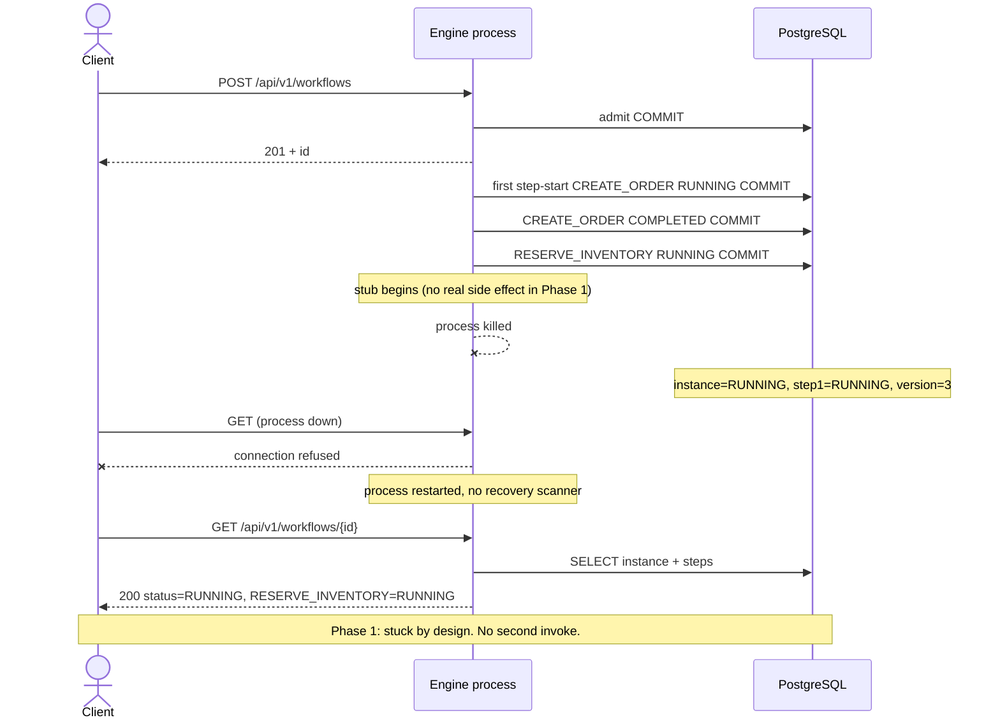
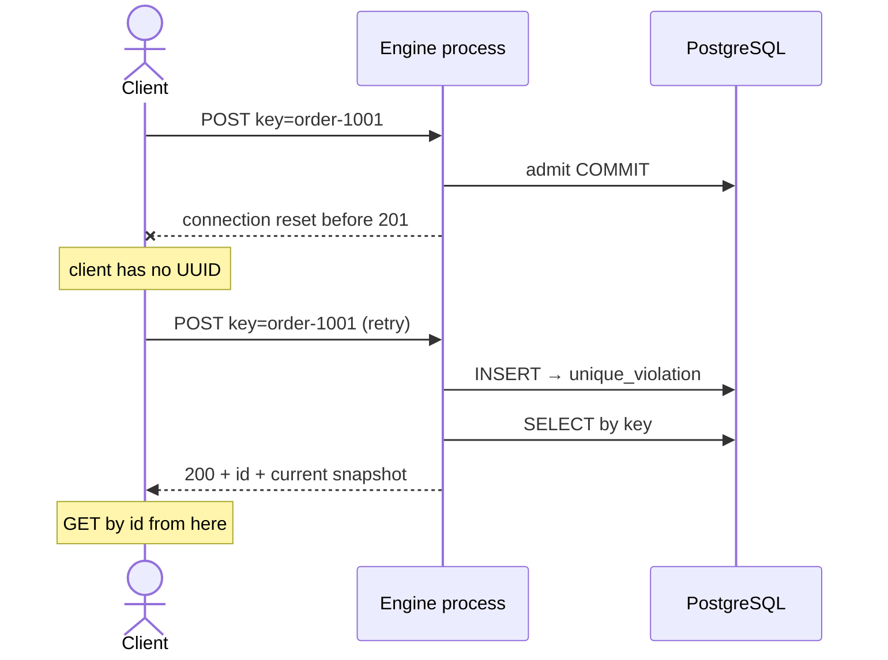
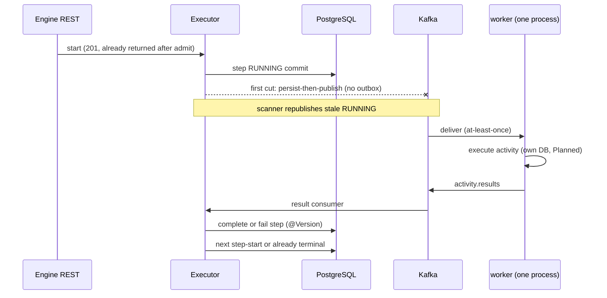
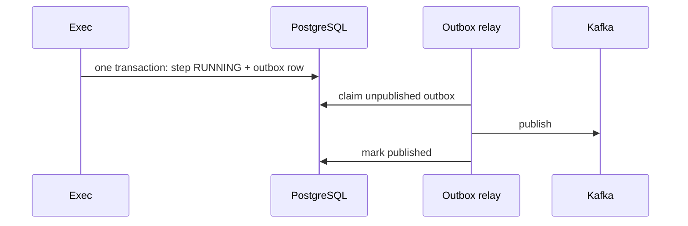

# Distributed Workflow Orchestration Platform

| Field | Value |
|---|---|
| **Author** | Engineering |
| **Date** | 2026-09-13 |
| **Status** | Draft. Phases 1–3 and 5–7 are implemented. Phase 4 was skipped. The product aim is a production-ready Temporal clone. The current code is the current-state core that clone is built on. Where an early section still says Phase 1 is the next slice, [Incremental Roadmap](#incremental-roadmap) is the status to follow. |
| **Type** | Architecture + incremental implementation plan |
| **Code in this revision** | Phases 1–3 and 5–7. History, deterministic replay, task-queue matching, and worker SDKs are the committed destination and are not in this revision. |

Honesty labels used throughout:

- **Phase 1** — the only implementation slice after this document is approved.
- **Planned** — a later, separately scoped increment. Not implied by Phase 1.
- **Theoretical** — discussed, and not part of the Temporal-clone destination unless a later revision promotes it.

---

## Overview

We will build a Java workflow engine that coordinates multi-step business processes across independent services. The first business example is a linear e-commerce order saga: create order, reserve inventory, process payment, create shipment, send notification. The engine owns orchestration state, scheduling, and recovery. Workers own business operations. Those two concerns must never collapse into an e-commerce monolith that happens to have a "workflow" package.

The product aim is a **production-ready Temporal clone**: event-sourced workflow history, deterministic replay of workflow code, task-queue matching, durable timers, signals, query handlers, and worker SDKs. This repository is that product. It is not a learning exercise and not a side project.

Phases 1–7 shipped the current-state core that clone stands on. PostgreSQL stores where the saga is now, and each transition commits before the next activity. History and replay are later phases of the same system. They are not a different product, and this revision does not pretend they are already running.

**Phase 1** is deliberately small: one Spring Boot process, PostgreSQL as the source of truth, a Java-coded linear `ORDER` definition, in-process stub activities, REST start/query, and Testcontainers tests. No Kafka. No worker services. No compensation. No replay. The hard problem in Phase 1 is a correct persisted state machine with **committed** transitions, not a distributed topology.

Admission is durable before any activity runs. `POST` returns an id as soon as the instance row is committed. Activities run on an in-process executor thread afterward. A crash mid-step leaves a readable `RUNNING` row and does not resume. That is the Phase 1 contract.

---

## Background & Motivation

### Why this exists

Business workflows fail in the gaps between services. Payment succeeds and shipment create crashes. The process restarts and nobody can answer "where is order 1001?" without tailing four log files. Ad-hoc cron retry jobs and "just call the next service from the controller" do not survive process death, deploys, or a second instance of the same app.

A workflow engine exists to make those gaps first-class:

- a durable record of *what has happened* and *what is next*
- a single query path for progress
- a place to hang retries, timeouts, compensation, and (later) async dispatch

### What the production Temporal clone is

Temporal is not "a REST API that runs steps." The production system this repository is building is approximately:

1. **Event-sourced history.** Every workflow decision, activity completion, timer, and signal is an event in an append-only history. Current state is *derived* by replay, not stored as `status = RUNNING`.
2. **Deterministic workflow replay.** Worker processes re-execute workflow *code* from the beginning on every wake-up. Non-determinism (time, random, unrecorded I/O) is a product bug. This forces a specialized SDK, versioning rules, and "patch" APIs.
3. **Task queues and a matching service.** Workflow and activity tasks are placed on queues; workers long-poll. This is a distributed matching problem, not `kafkaTemplate.send`.
4. **Durable timers, signals, queries, updates.** These are history events, not `Thread.sleep` and not a REST afterthought.
5. **A multi-service control plane.** Frontend, history, matching, worker SDK — years of work by a dedicated team.

The implemented phases built the persisted state machine first, so a history service and a replay loop have a correct saga underneath them. The destination is that full system, production-ready.

We are honest about prior art:

| System | What it really is | Relation to us |
|---|---|---|
| Temporal / Cadence | Durable execution via history + deterministic replay + worker poll | **Product destination.** Phases 1–7 are the current-state core, not the finished clone. |
| AWS Step Functions | Managed state machine, JSON (ASL) definitions, external activities | Close to our *target* shape |
| Netflix Conductor | Server-owned state, JSON definitions, HTTP-polling workers | Close to early **Planned** phases |
| Local saga / process manager | Orchestrator with current-state rows | **Phase 1** |

### Current state of this repository

Greenfield. `/Users/ganesh/workdir/xAI/projects/distributed-workflow-engine` is empty. There is no legacy schema, no existing package naming, and no client to stay wire-compatible with. That is a gift: we can choose a small surface and keep it.

### Pain we refuse to import on day 1

A tempting "serious" first commit is: five microservices, Kafka, gRPC, a saga library, Prometheus, Jaeger, and empty `workers-*` modules. That commit produces a compose file and zero confidence that workflow state is correct. We will not do it. The reasoning is in [Architectural Refusals](#architectural-refusals) and [Alternatives Considered](#alternatives-considered).

---

## Goals & Non-Goals

### Goals

- Ship a production-ready Temporal clone in phases. Each phase is a running, tested system with an explicit consistency story.
- **Phase 1:** persist a linear order workflow, return an id after admission, run five stub steps in-process, query status, survive process restart *as committed data*, prove transaction boundaries with Testcontainers.
- Keep activity *implementations* movable. Do not pretend the Phase 1 synchronous invoker is the Phase 5 dispatch path.
- Keep business rules out of the engine. Stubs return canned JSON. They do not check stock or talk to a card network.
- Make PostgreSQL the system of record for orchestration metadata. Kafka, when it appears, is transport.
- Label every capability **implemented**, **Planned**, or **destination** so Phase 7 is not described as the finished clone.

### Destination (committed; not in the current code)

- Event-sourced workflow history and deterministic replay of workflow code.
- Task-queue matching and worker SDKs.
- Durable timers, signals, and query handlers as history events.
- Deterministic workflow-as-code, including the sandbox that replay requires.

### Non-goals of the current-state phases

- Treating Phase 7 as a finished Temporal replacement. History and replay land in their own phases.
- Kafka, gRPC, or any worker protocol inside Phase 1. Kafka dispatch is implemented in Phase 5. gRPC stays Phase 12.
- Separate order / inventory / payment / shipping / notification services until a real ownership boundary exists (Phase 8). One worker process is what Phase 5 shipped.
- Adding query handlers, child workflows, or continue-as-new inside the current-state executor. They belong to the history and replay phases. `GET` of stored state is not a query handler.
- Visual workflow designer, BPMN, and a custom DSL parser. The clone is workflow-as-code, as Temporal is.
- Multi-tenant namespaces, a service mesh, and Kubernetes operators before the durable-execution core is production-ready.
- XA / two-phase commit across business resources. Refused permanently. The saga model stays.
- A production SLA or horizontal scale in Phase 1. Production readiness is the destination, after history, replay, matching, and the scale phases.

---

## Key Decisions

These are decided. They are not open questions. Phase 1 implementation forks that used to be implicit are in this table on purpose.

| Decision | Choice | Rationale |
|---|---|---|
| Product shape | Current code is a durable current-state orchestrator. The product destination is a production-ready Temporal clone: history, deterministic replay, task matching, and worker SDKs. | The state machine shipped first so replay has a correct core. Replay is the committed end state. |
| Phase 1 topology | One Spring Boot process + Postgres. No Kafka. No worker modules. | State-machine correctness is independent of transport. Kafka before a SoT is how you distribute bugs. |
| Source of truth | PostgreSQL for workflow/step rows | Queryable, transactional, restart-safe. Kafka is not a workflow store. |
| Workflow definition | Java code (`OrderWorkflowDefinition`), `version() = 1`, persisted as `definition_version` | Type-safe, no interpreter. The version that *ran* must be on the row so Phase 2 resume is defined. |
| Identity | Server-generated workflow UUID | Primary key is not a client-owned business id. |
| Idempotency key | **Required** on Phase 1 `POST` (`1..128` chars) | Crash during `POST` after admission must still have a client-visible handle. Retry is `POST` with the same key. Optional keys + no list API = leaked rows with no name. Optional keys are **Planned** once a list or lookup-by-key exists. |
| Maven coordinates | `groupId`: `com.workflowengine` | Readable, not trademark-adjacent. Artifact names in English. No Temporal type names that imply wire compatibility. |
| Parent POM | Aggregator `pom` imports `spring-boot-dependencies` **4.1.x BOM**. It does **not** use `spring-boot-starter-parent`. `engine` applies `spring-boot-maven-plugin`. | `engine-api` must stay a plain jar. Starter-parent on the root would push Boot plugin/config onto the API module. |
| Module layout | Parent + `engine-api` + `engine` only | `engine-api` is the shared contract (statuses, snapshots, `Activity*`). Empty `workers-*` modules are refused. |
| `engine-api` dependencies | JDK only. No Spring, JPA, Kafka, Jackson, Lombok. JSON inside activity records travels as `String`. | Workers must depend on contracts, not the Boot app. Spring Kafka serializes `ActivityContext` and `ActivityCompletion` as JSON on the topics. |
| Lombok | **`engine` only.** `@Getter`/`@Setter`/`@NoArgsConstructor` on JPA entities; `@Slf4j`; `@RequiredArgsConstructor` for simple injection. Never `@Data` / `@EqualsAndHashCode` on entities. | Cuts boilerplate in the Boot module. `engine-api` stays a plain JDK jar so workers do not inherit an annotation processor. |
| Execution model (Phase 1) | **Admit-then-run.** The admit transaction commits instance+steps. `POST` returns `201` + `Location` + id. An in-process executor thread then runs the saga. Still one JVM, no Kafka. | Sync-to-terminal was convenient and lost the only handle on crash-during-POST. GET is how tests wait for `COMPLETED`. |
| Wait-for-terminal on POST | **Not** in the Phase 1 API | A `?wait=true` flag would ossify "POST is complete" and is unnecessary once the id is in the `201`. Curl uses `POST` then `GET`. |
| Units of work | **Commit-before-invoke.** Activity `execute` is never inside an open workflow transaction. See [Units of work](#units-of-work-phase-1). | A single `@Transactional` around start+run rolls back `RUNNING` on crash and falsifies the Phase 1 guarantee. |
| Crash mid-step (Phase 1) | After a committed `RUNNING` write, invoke. On restart, leave it `RUNNING`. Do **not** auto-resume. Do **not** start the executor on idempotent `200`. | Phase 1 contract. |
| Crash leftovers (Phase 2) | Scanner resumes never-started `PENDING` and due `RUNNING` (`attempt++`) while `deadline_at` is still in the future. `FAILED` is not retried. Idempotent `200` still does not submit. | At-least-once steps; stubs remain non-idempotent. |
| Step timeout (Phase 3) | Per-attempt `deadline_at` from the engine `Clock` plus `StepDefinition.timeout`. Poller writes step and instance `FAILED` with error `TIMED_OUT`. No new status enum. Late success is discarded. An expired leftover is not re-invoked. | Durable time is a row plus a clock. `ORDER` uses 5 minutes. Distinct `TIMED_OUT` status stays planned until a phase branches on it. Not a timer step. |
| Version column | Integer `version` on `workflow_instance`, mapped as JPA **`@Version` only** | Do **not** also write `version = version + 1` in custom SQL. One increment per instance-touching transaction. Happy-path terminal `version = 10` (see transition table). |
| Step order | `workflow_step.position INT NOT NULL` + `UNIQUE (workflow_instance_id, position)` | Names are not an order. `ORDER BY started_at` fails for `PENDING` tails. |
| Inter-step I/O | Every activity receives `workflowInputJson` re-serialized from the instance `input_json` row (same JSON **value** for every step). `stepInputJson` is **null**. Engine does **not** chain `output_json`. | JSONB will not preserve request whitespace/key order. Chaining is a later product decision. |
| Instance `output_json` | On instance `COMPLETED`, copy the last step’s `output_json`. On `FAILED` / in-flight, `null`. | The column is not a zombie and is not an aggregate of all steps. |
| History table | **Not** in Phase 1 | Nothing replays, no audit UI. Step rows already record per-step outcomes. `workflow_event` is **Planned**. |
| Activity port honesty | Phase 1 `ActivityInvoker.invoke` is a **sync in-process port**. Phase 5 **rewrites** `WorkflowExecutor` from invoke-and-wait to dispatch-and-complete-later. Reuse `Activity` + stub classes, not the executor as-is. | A blocking `ActivityResult` cannot be Kafka without `future.get()` theatre. |
| Where `Activity*` live | `engine-api`: `Activity`, `ActivityContext`, `ActivityResult`, statuses, snapshots, start command | Worker module must not depend on `engine`. |
| Activity stub location | `com.workflowengine.activity.stub` inside `engine` | Demo adapters. They implement `engine-api` `Activity`. |
| Schema migrations | Flyway SQL | Reviewable, explicit. `ddl-auto` is a spike tool. |
| Repo shape | Monorepo | One team, one version, atomic `engine-api` changes. |
| REST package | `com.workflowengine.web` | Do not call the controller package `com.workflowengine.api` — that name is the `engine-api` module. |
| Canceled spelling | `CANCELED` (one L) | One enum spelling when the state is introduced (**Planned**). Not a Phase 1 value. |
| Worker extraction order | `Activity` in Phase 1 → one out-of-process worker (Phase 5) → split services only when a service owns its data (Phase 8) | Five microservices on day 1 optimize for org-chart theatre. |
| Multi-instance engine | **Planned** Phase 9, and *only after* activities are out-of-process | Two engine processes running in-process payment stubs is a double-charge bug with extra YAML. |
| Product aim | A production-ready Temporal clone | This repository is that product. Phase 7 is the current-state core, not the finished system. Do not describe the project as a learning exercise or a side project. |

---

## Architectural Refusals

A senior engineer would reject the following even if they photograph well in a slide deck. We reject them in writing so a later PR cannot "just add" them without changing this document.

### 1. Five microservices + Kafka + gRPC on day 1

**Refused.** That is an operations project masquerading as a workflow project. The first question we must answer is: *after the process dies, is the workflow still there, and is it consistent?* That is a Postgres transaction and a state machine. It does not require a broker, a mesh, or five `Dockerfile`s.

Cost of the naive start: weeks of compose, topic naming, consumer-group debugging, and still no proof that `PROCESS_PAYMENT` cannot run twice after a crash.

### 2. Kafka as the source of truth for workflow state

**Refused.** Kafka is transport. Workflow history for replay is an append-only history owned by the engine, not a rebuild of instance state from task topics. Consumers lag, compaction is easy to get wrong, and "where is order 1001?" must not depend on a consumer-group assignment. Until the history phase, Postgres rows answer it with `SELECT`.

### 3. Shared database across future business services

**Refused.** The engine database stores orchestration metadata only. When workers are extracted, each owns its data. Phase 1 stubs write *no* business tables — that emptiness is correct. An `orders` table in the engine schema would make extraction a migration project and would turn the engine into a commerce monolith.

### 4. Two-phase commit / XA for the order saga

**Refused permanently.** Payment providers, inventory systems, and carriers do not join our XA transaction. 2PC does not survive a participant being down for an hour. The model is a saga: forward steps, later compensation (**Planned** Phase 7).

### 5. Deterministic replay before a working state machine

**Refused inside the current-state phases.** Replay is how the Temporal clone makes workflow code durable, and it is the product destination. The rows through Phase 7 store current state. A history service and a replay loop land in their own phase, after this document describes that phase. Do not bolt a history log onto `WorkflowExecutor` in a drive-by change.

### 6. Business logic inside the engine

**Refused.** The engine may know that `ORDER` has five named steps and that a step failed. It may not know what "insufficient stock" means, how to authorize a card, or how to rate-shop a carrier. Stubs exist only to exercise the state machine.

### 7. Generic visual designer / BPMN / custom DSL

**Refused** for the entire near-term roadmap. That is a separate product. We have one linear workflow defined in Java.

### 8. Service mesh, Kubernetes operators, custom controllers

**Refused** until we have multiple processes with a real network failure story. Phase 1 runs on a laptop with Docker for Postgres.

### 9. Empty worker modules "for later"

**Refused.** Dead Maven modules rot, CI wastes time, and they create the illusion of a distributed system. Modules appear in the PR that first has a class a JVM will load. `engine-api` is created in PR-01 *with* `WorkflowStatus` and `StepStatus`, not as a placeholder `package-info`.

### 10. Spring Statemachine (or similar in-process SM library) as the engine

**Refused** as the durability story. Those libraries coordinate an in-memory machine. We need many instances, disk, and `GET /workflows/{id}`. Our state machine *is* the tables plus `WorkflowExecutor`.

### 11. One `@Transactional` around admission + all invokes

**Refused.** That pattern is the default Spring instinct and it destroys the Phase 1 crash guarantee. See [Units of work](#units-of-work-phase-1).

---

## Proposed Design

### Target architecture (**Planned**, not day 1)

One control-plane process family (`workflow-engine`) owns instance lifecycle, step scheduling, retries, and timeouts. Independent activity workers own business operations and, once extracted, their own databases. Clients talk REST to the engine. The engine talks to workers asynchronously (Kafka first). Postgres remains SoT. Kafka never becomes SoT.

Outbox, when introduced, is a *table written in the same transaction as state*, plus a relay. It is not a sidecar in front of the database and it is not a second publish path next to a direct `Exec → Kafka` edge.



Phase 5 **first cut** (also **Planned**, distinct from outbox): persist `RUNNING` then `Exec -.-> Kafka` directly; a scanner republishes stale `RUNNING` tasks. That dashed path is *instead of* the relay, not in addition to it. Promote to outbox when persist-then-publish loses a message we cannot tolerate.

Later options, only if justified:

- gRPC worker long-poll (**Planned** Phase 12, if Kafka request/response is operationally painful).
- Horizontal engine instances with `SELECT FOR UPDATE SKIP LOCKED` or a leader + lease (**Planned** Phase 9).
- Signals, timer steps, branching (**Planned** Phase 10).
- Observability stack and a workflow UI (**Planned** Phase 11).
- Deterministic replay and query handlers (**product destination**, not in the current code).

### Phase 1 architecture (the only slice we implement next)



What this diagram deliberately omits: Kafka, gRPC, five workers, Redis, Elasticsearch, a UI, a history service.

**Phase 1 performance posture:** correctness-first, single instance, no SLA. Throughput targets (workflows/sec) are irrelevant. Local/dev only. Tests are local (Maven + Testcontainers). There is no CI requirement in Phase 1. What must change before multi-instance is listed in [Phase 9](#phase-9--horizontal-engine-scaling-planned).

### Distributed-systems concepts in play in Phase 1

These invariants are already in the running code:

- **Orchestration vs choreography.** One process decides what runs next. Services do not subscribe to each other's domain events yet.
- **Source of truth.** Engine metadata is strongly consistent in Postgres. The *business* saga will be eventually consistent once workers exist. Those are different guarantees; do not mix them.
- **Idempotent admission.** Concurrent `POST`s with the same key must not create two instances and must not return `500`.
- **Commit visibility.** A second connection can read `RUNNING` *before* the activity returns. That is the definition of persist-before-invoke.
- **Optimistic concurrency.** `@Version` is the contract two writers will need, even if Phase 1 has one writer.
- **At-least-once is already real.** A crash *after* a stub ran and *before* `COMPLETED` is persisted means the step stays `RUNNING`. Re-running it later is a second execution. Phase 1 refuses to re-run. Phase 2 will re-run. Phase 6 will make that safe.
- **Exactly-once is not a transport feature.** It is at-least-once + idempotent handlers. We say this out loud so nobody "adds Kafka transactions" to dodge activity idempotency.

### Order workflow as a linear state machine (**Phase 1**)

Phase 1 `ORDER` is a static, versionable, ordered list of steps. No branches, no parallel gate, no timers, no signals.



Step-level machine (same four states in Phase 1):



**Planned** step states (do not add columns or enum values until a phase needs them): `TIMED_OUT`, `CANCELED`, `COMPENSATING`, `COMPENSATED`, `SKIPPED`.

**Planned** instance states: `TIMED_OUT`, `CANCELED`, `COMPENSATING`, `COMPENSATED`.

Spelling is `CANCELED` (one L) when those values appear.

### Units of work (Phase 1)

This is load-bearing. Implementers who wrap `StartWorkflowService` or `WorkflowExecutor.run` in one `@Transactional` will ship a system that *looks* tested and loses `RUNNING` on a real crash.

**Rule:** every state transition is its own committed transaction. `Activity.execute` runs with **no** open workflow transaction.

Named transactions (do not number them TX1/TX2):

| Name | Meaning |
|---|---|
| **Admit transaction** | First commit: instance + steps `PENDING`. The `201` body is this snapshot. |
| **First step-start transaction** | First step `RUNNING` and instance `PENDING→RUNNING` in one commit. Then invoke. |
| **Step-start transaction** | Later steps `PENDING→RUNNING`. Then invoke. |
| **Mid-step complete transaction** | A non-last step `COMPLETED`. Instance stays `RUNNING`. |
| **Workflow-complete transaction** | Last step `COMPLETED` and instance `COMPLETED` in one commit. |
| **Step-fail transaction** | Failed step and instance `FAILED` in one commit. |

| Transaction | Writes | Then |
|---|---|---|
| **Admit** | `INSERT` instance `PENDING`, `version=0`, `definition_version=1`, `current_step=NULL`, `output_json=NULL` **and** five steps `PENDING`, `position=0..4`, `attempt=0`, null timestamps / I/O / error. One commit. | HTTP thread may return `201`. Only the INSERT winner submits the executor. |
| **First step-start** | First step → `RUNNING`, `attempt=1`, `started_at=now()`; instance → `RUNNING`, `current_step=CREATE_ORDER`. `@Version` 0→1. | **Commit. Then** invoke. |
| **Step-start** (steps 2–5) | That step → `RUNNING`, `attempt++`, `started_at=now()`; instance `current_step=name`. `@Version` +1. | **Commit. Then** invoke. |
| **Mid-step complete** (steps 1–4) | Step → `COMPLETED`, `output_json`, `completed_at=now()`, `error=NULL`; instance unchanged except `@Version` +1. | Next step-start transaction. |
| **Workflow-complete** | Last step → `COMPLETED` **and** instance → `COMPLETED`, `current_step=SEND_NOTIFICATION`, `output_json` = last step output, `error=NULL`. One commit. `@Version` +1. | Stop. |
| **Step-fail** | Failed step → `FAILED`, `error`, `completed_at=now()` (yes, set on failure); instance → `FAILED`, `current_step` = failed step, `error` = copy of step error, `output_json=NULL`. One commit. `@Version` +1. | Stop. Later steps stay `PENDING`. |

Fold instance `PENDING→RUNNING` into the **first step-start** transaction. Do **not** add a separate instance-only `RUNNING` transaction — that would be an extra `version++` and a crash window with instance `RUNNING` and all steps `PENDING`.

Do **not** commit last-step `COMPLETED` and instance `COMPLETED` in two transactions — that crash window is instance `RUNNING` + five `COMPLETED` steps, which a step scanner cannot repair.

### Transition table (the implementable contract)

`N` is instance `@Version` **after** the transaction commits. Start of life is `N=0` (admission). Happy-path terminal is **`N=10`**.

| Event | From instance | From step | To instance | To step | `version` after commit | `current_step` after commit | Other columns |
|---|---|---|---|---|---|---|---|
| Admit | — | — | `PENDING` | five × `PENDING` | 0 | `NULL` | `definition_version=1`; step `position=0..4`; `attempt=0` |
| Start step 1 | `PENDING` | step0 `PENDING` | `RUNNING` | step0 `RUNNING` | 1 | `CREATE_ORDER` | `attempt=1`; `started_at=now()` |
| Complete step 1 | `RUNNING` | step0 `RUNNING` | `RUNNING` | step0 `COMPLETED` | 2 | `CREATE_ORDER` | step `output_json`; `completed_at=now()` |
| Start step 2 | `RUNNING` | step1 `PENDING` | `RUNNING` | step1 `RUNNING` | 3 | `RESERVE_INVENTORY` | `attempt=1`; `started_at` |
| Complete step 2 | `RUNNING` | step1 `RUNNING` | `RUNNING` | step1 `COMPLETED` | 4 | `RESERVE_INVENTORY` | |
| Start step 3 | `RUNNING` | step2 `PENDING` | `RUNNING` | step2 `RUNNING` | 5 | `PROCESS_PAYMENT` | |
| Complete step 3 | `RUNNING` | step2 `RUNNING` | `RUNNING` | step2 `COMPLETED` | 6 | `PROCESS_PAYMENT` | |
| Start step 4 | `RUNNING` | step3 `PENDING` | `RUNNING` | step3 `RUNNING` | 7 | `CREATE_SHIPMENT` | |
| Complete step 4 | `RUNNING` | step3 `RUNNING` | `RUNNING` | step3 `COMPLETED` | 8 | `CREATE_SHIPMENT` | |
| Start step 5 | `RUNNING` | step4 `PENDING` | `RUNNING` | step4 `RUNNING` | 9 | `SEND_NOTIFICATION` | |
| Complete step 5 | `RUNNING` | step4 `RUNNING` | **`COMPLETED`** | step4 `COMPLETED` | **10** | `SEND_NOTIFICATION` | instance `output_json` = step4 output |
| Fail step k | `RUNNING` (or `PENDING` if k=0 start already flipped) | step k `RUNNING` | **`FAILED`** | step k `FAILED` | previous+1 | failed step name | instance+step `error` set; `completed_at` set; later steps remain `PENDING` |

`current_step` rules:

- `PENDING` never started: `NULL`.
- `RUNNING`: the step that is `RUNNING` (the one last started).
- `COMPLETED`: last step name (`SEND_NOTIFICATION`).
- `FAILED`: the step that failed.

`failAt=PROCESS_PAYMENT` (step index 2): versions 0,1,2,3,4,5 then the step-fail transaction → instance `FAILED`, `current_step=PROCESS_PAYMENT`, `version=6`. Steps 0–1 `COMPLETED`, step 2 `FAILED`, steps 3–4 `PENDING`.

`failAt=CREATE_ORDER`: first step-start commits step 0 (`version=1`), invoke fails, step-fail transaction → instance `FAILED`, `current_step=CREATE_ORDER`, `version=2`. Steps 1–4 `PENDING`.

Unknown `failAt` value: all stubs succeed (they only fail on exact name match).

### Package boundaries

```
com.workflowengine
  WorkflowEngineApplication          engine module
  web                                REST adapters only — not named .api
    WorkflowController
    BodySizeFilter
    RestExceptionHandler
  application
    StartWorkflowService             admit transaction + submit executor; idempotent reload
    GetWorkflowService
  domain
    WorkflowDefinition
    WorkflowDefinitionRegistry
    StepDefinition
  definition
    OrderWorkflowDefinition
  activity
    ActivityInvoker                  engine runtime port (sync)
    InProcessActivityInvoker
    ActivityRegistry
    stub                             IN-PROCESS DEMO ONLY
      CreateOrderActivity
      ReserveInventoryActivity
      ProcessPaymentActivity
      CreateShipmentActivity
      SendNotificationActivity
  runtime
    WorkflowExecutor                 one transaction per transition; invoke outside it
  persistence
    entities, Spring Data, Flyway-aligned
```

`engine-api` (`com.workflowengine.api`):

```
com.workflowengine.api
  WorkflowStatus
  StepStatus
  StartWorkflowCommand
  WorkflowSnapshot
  StepSnapshot
  activity
    Activity
    ActivityContext
    ActivityResult
```

`WorkflowDefinition` and `StepDefinition` live **only** in `engine` (`domain` / `definition`). Workers do not need them. Do not put those types in `engine-api`.

`WorkflowExecutor` must not import `activity.stub`. It depends on `ActivityInvoker`.

**Honest extraction story:** Phase 5 moves `Activity` implementations to `worker` and **rewrites** the executor’s loop (dispatch, then a result handler). `InProcessActivityInvoker` does not grow a Kafka implementation that blocks on a reply.

---

## Repository Structure

### Phase 1 layout (create only this)

```
distributed-workflow-engine/
  pom.xml                      aggregator; imports spring-boot-dependencies 4.1.x BOM
  engine-api/                  JDK-only contracts
    pom.xml
    src/main/java/com/workflowengine/api/...
  engine/                      Spring Boot application + orchestration core
    pom.xml                    spring-boot-maven-plugin
    src/main/java/com/workflowengine/...
    src/main/resources/
      application.yml
      db/migration/V1__init.sql
    src/test/java/com/workflowengine/...
  docker-compose.yml           PostgreSQL 16 only
  docs/                        this design document, copied when docs/ is created (PR-04)
  README.md
```

Parent coordinates:

- `groupId`: `com.workflowengine`
- `artifactId`: `distributed-workflow-engine`
- `version`: `0.1.0-SNAPSHOT`
- `packaging`: `pom`
- modules: `engine-api`, `engine`
- Java 21
- `dependencyManagement`: import `org.springframework.boot:spring-boot-dependencies:4.1.x` (BOM)
- JUnit 5, Testcontainers PostgreSQL managed via that BOM / Testcontainers BOM as needed

`engine-api` allowed dependencies: **none** beyond the JDK. No Spring, JPA, Kafka, Jackson, Lombok.

`engine-api` exists in Phase 1 because it is a *used* seam: REST snapshots, status enums, and `Activity` types that a future `worker` can depend on without depending on `engine`.

### How the repo grows (**Planned**, do not create now)

| When | Module | Why then, not now |
|---|---|---|
| Phase 5 | `worker` (singular) | First out-of-process process. One JVM handles all five activity types. Depends on `engine-api` only. |
| Phase 8 | `worker-order`, … only when a service owns its data | Not before. |
| Phase 5+ | `docker-compose.yml` gains Kafka + worker | Not before the executor is ready to become async. |
| Phase 11 | optional `console` UI | After the API is stable. |

### Monorepo vs polyrepo

**Monorepo.** This is one product and one team. `engine-api` will change in the same commit as `engine` and, later, `worker`. Polyrepo would buy independent release cycles we do not have.

---

## Service Boundaries

### Engine owns

- Workflow instance lifecycle (`PENDING` → `RUNNING` → `COMPLETED` | `FAILED`, later more).
- Step records, scheduling order (`position`), current step pointer.
- Admission idempotency (required key, unique constraint, unique-violation → reload).
- Orchestration-level optimistic locking (`@Version`).
- **Planned:** retry/timeout policy *execution*, recovery scanning, compensation *ordering*, task dispatch, result correlation.
- The engine database.

The engine does **not** own order totals, inventory counts, payment authorizations, tracking numbers, or email templates.

### Workers own (when they exist; **Planned**)

- The business operation for one activity name (or several, in the first worker process).
- Their own databases and schemas.
- Activity-level idempotency keys (engine will pass `workflowId + stepName + attempt` so workers can dedupe).
- Their own retries against *downstream* systems if those are not the engine's problem.

### Boundary rule that keeps us honest

If a class in `engine` needs a column like `inventory_reserved` or `payment_intent_id` as *business state*, it is in the wrong process. Those values may appear *opaquely* in `output_json` for debugging; the engine must not query them to make commerce decisions. The engine also must not read step `output_json` to build the next `stepInputJson` in Phase 1.

---

## Data Model Changes

### Phase 1 schema (Flyway `V1__init.sql`)

PostgreSQL 16. JSON payloads are `JSONB`. Timestamps are `TIMESTAMPTZ`, assigned by PostgreSQL (`DEFAULT now()` / `now()` in writes). The API serializes values **read back from the DB**. Tests must not assert equality with `Instant.now()` from the JVM.

```sql
CREATE TABLE workflow_instance (
    id                  UUID PRIMARY KEY,
    type                VARCHAR(64)  NOT NULL,
    definition_version  INT          NOT NULL,
    status              VARCHAR(32)  NOT NULL,
    input_json          JSONB        NOT NULL,
    output_json         JSONB,
    current_step        VARCHAR(64),
    idempotency_key     VARCHAR(128) NOT NULL,
    version             INT          NOT NULL DEFAULT 0,
    error               TEXT,
    created_at          TIMESTAMPTZ  NOT NULL DEFAULT now(),
    updated_at          TIMESTAMPTZ  NOT NULL DEFAULT now(),
    CONSTRAINT chk_workflow_instance_status
      CHECK (status IN ('PENDING', 'RUNNING', 'COMPLETED', 'FAILED')),
    CONSTRAINT chk_workflow_instance_def_ver
      CHECK (definition_version >= 1)
);

CREATE UNIQUE INDEX uq_workflow_instance_idempotency_key
    ON workflow_instance (idempotency_key);

CREATE INDEX idx_workflow_instance_status
    ON workflow_instance (status);

CREATE TABLE workflow_step (
    id                    UUID PRIMARY KEY,
    workflow_instance_id  UUID         NOT NULL
        REFERENCES workflow_instance (id),
    name                  VARCHAR(64)  NOT NULL,
    position              INT          NOT NULL,
    status                VARCHAR(32)  NOT NULL,
    attempt               INT          NOT NULL DEFAULT 0,
    input_json            JSONB,
    output_json           JSONB,
    error                 TEXT,
    started_at            TIMESTAMPTZ,
    completed_at          TIMESTAMPTZ,
    CONSTRAINT uq_workflow_step_instance_name
      UNIQUE (workflow_instance_id, name),
    CONSTRAINT uq_workflow_step_instance_position
      UNIQUE (workflow_instance_id, position),
    CONSTRAINT chk_workflow_step_status
      CHECK (status IN ('PENDING', 'RUNNING', 'COMPLETED', 'FAILED')),
    CONSTRAINT chk_workflow_step_attempt
      CHECK (attempt >= 0),
    CONSTRAINT chk_workflow_step_position
      CHECK (position >= 0)
);
```

There is **no** `idx_workflow_step_instance`. `UNIQUE (workflow_instance_id, name)` and `UNIQUE (workflow_instance_id, position)` already support lookup-by-instance. Snapshot queries: `ORDER BY position`.

`idx_workflow_instance_status` is unused by the Phase 1 *runtime* and is present for Phase 2: find `PENDING` (never started) and `RUNNING` (mid-step) leftovers. It is not a license to treat `FAILED` as resumeable.

`idempotency_key` is `NOT NULL` with a full unique index. Phase 1 does not allow key-less instances, so a partial unique index is unnecessary.

#### Later columns (expand-only)

| Migration | Column | Who writes it |
|---|---|---|
| `V2__step_next_attempt_at.sql` | `workflow_step.next_attempt_at` | Engine `Clock` on running-resume when backoff is non-zero. Null means due now. |
| `V3__step_deadline_at.sql` | `workflow_step.deadline_at` | Engine `Clock` on step-start and running-resume. Null means no timeout, including rows that were already `RUNNING` when the column was added. The Phase 3 poller reads it. |

#### Why these columns exist now

| Column | Phase 1 use | Why not later |
|---|---|---|
| `idempotency_key` unique NOT NULL | Safe POST retry; crash handle | Optional keys need a list API we do not have |
| `version` + `@Version` | One increment per instance-touching transaction | Multi-instance and recovery need it |
| `definition_version` | Written from `OrderWorkflowDefinition.version()` | Resume against a renamed Java list is undefined without it |
| `position` | Snapshot order; executor walk | `ORDER BY started_at` is wrong for `PENDING` tails |
| `attempt` | Set to 1 when the step first starts | Phase 2 retry must not add a column under load |
| `status` index on instance | Unused at runtime | Phase 2 scanner is `WHERE status IN ('PENDING','RUNNING')` |
| `input_json` / `output_json` on steps | `input_json` stays null in Phase 1; `output_json` holds stub output | Avoids a later "nowhere to put activity I/O" migration |

#### Step write protocol

| When | `status` | `attempt` | `input_json` | `output_json` | `error` | `started_at` | `completed_at` |
|---|---|---|---|---|---|---|---|
| Admit | `PENDING` | 0 | `NULL` | `NULL` | `NULL` | `NULL` | `NULL` |
| Step-start | `RUNNING` | increment (0→1 in Phase 1) | stays `NULL` | `NULL` | `NULL` | `now()` | `NULL` |
| Mid-step complete / workflow-complete | `COMPLETED` | unchanged | `NULL` | result JSON | `NULL` | unchanged | `now()` |
| Step-fail | `FAILED` | unchanged | `NULL` | optional stub output or `NULL` | non-null message | unchanged | `now()` |

Instance write protocol (same transactions):

| When | `status` | `current_step` | `output_json` | `error` | `updated_at` |
|---|---|---|---|---|---|
| Admit | `PENDING` | `NULL` | `NULL` | `NULL` | `now()` |
| First start | `RUNNING` | first step name | `NULL` | `NULL` | `now()` |
| Mid success | `RUNNING` | unchanged until next start | `NULL` | `NULL` | `now()` |
| Later start | `RUNNING` | that step name | `NULL` | `NULL` | `now()` |
| Last success | `COMPLETED` | last step name | last step `output_json` | `NULL` | `now()` |
| Any step fail | `FAILED` | failed step name | `NULL` | copy of step `error` | `now()` |

#### Why there is no `workflow_event` table yet

An append-only history is the right model *if* we replay, audit in a UI, or debug transitions across many writers. In Phase 1 we do not replay, have no UI, have one writer, and `workflow_step` already stores per-step outcome. A table that nothing reads is ceremony. **Planned** (Phase 2 recovery or Phase 11 UI): `workflow_event`.

Storage math: one order workflow ≈ 5–10 KB. A million historical workflows is on the order of 10 GB. Irrelevant for Phase 1. No partitioning, archival, or Elasticsearch.

### Enums (**Phase 1**)

```java
public enum WorkflowStatus { PENDING, RUNNING, COMPLETED, FAILED }
public enum StepStatus     { PENDING, RUNNING, COMPLETED, FAILED }
```

Do not add `CANCELED` / `TIMED_OUT` until a phase implements the transition.

### Order definition (**Phase 1**)

Java, not JSON. Version 1 is linear. Retry policy is Phase 2. Timeout is Phase 3: `StepDefinition.timeout` plus `workflow_step.deadline_at`. `ORDER` uses 5 minutes per attempt. A null timeout means no deadline.

```java
public final class OrderWorkflowDefinition implements WorkflowDefinition {
    public static final String TYPE = "ORDER";

    @Override public String type() { return TYPE; }
    @Override public int version() { return 1; }

    @Override
    public List<StepDefinition> steps() {
        return List.of(
            new StepDefinition("CREATE_ORDER"),
            new StepDefinition("RESERVE_INVENTORY"),
            new StepDefinition("PROCESS_PAYMENT"),
            new StepDefinition("CREATE_SHIPMENT"),
            new StepDefinition("SEND_NOTIFICATION")
        );
    }
}
```

`position` is the index in this list (`0..4`). Unknown `type` on POST → HTTP 400. Only `ORDER` is registered in Phase 1.

### Critical interfaces (illustrative; implement after approval)

Definitions stay in **`engine`** (`com.workflowengine.domain`). They are not worker contract types:

```java
public interface WorkflowDefinition {
    String type();
    int version();
    List<StepDefinition> steps();
}

public record StepDefinition(String name) {}
```

`engine-api` — no Jackson, no Spring. Statuses, snapshots, start command, and `Activity*` only:

```java
public interface Activity {
    String name();
    ActivityResult execute(ActivityContext context);
}

public record ActivityContext(
    java.util.UUID workflowId,
    String workflowType,
    int definitionVersion,
    String stepName,
    int attempt,
    String workflowInputJson,  // JSON value re-serialized from instance.input_json; never null
    String stepInputJson       // Phase 1: always null
) {}

public record ActivityResult(
    boolean success,
    String outputJson,
    String error
) {}
```

`engine` runtime port (not in `engine-api`; Phase 5 will not implement this with Kafka):

```java
public interface ActivityInvoker {
    ActivityResult invoke(ActivityContext context);
}
```

`InProcessActivityInvoker`:

- Looks up `Activity` by `stepName`.
- On miss: returns `ActivityResult(false, null, "UNKNOWN_ACTIVITY:" + stepName)` — does **not** throw.
- On `Activity.execute` throwing: catches, returns `ActivityResult(false, null, "ACTIVITY_EXCEPTION:" + exception class + optional message)`.
- Never throws to `WorkflowExecutor` for lookup misses or stub/business failures.
- Does not interpret `failAt`. Stubs do.

`WorkflowExecutor` treats any `success=false` as the step-fail transaction above. Persistence and optimistic-lock failures on the **executor thread** are infrastructure, not step `FAILED`: do not retry the activity, do not mark the step `FAILED`, log and stop. See [Executor-thread infrastructure failures](#executor-thread-infrastructure-failures-phase-1).

### Inter-step I/O (**Phase 1**)

- `workflowInputJson` is the JSON **value** re-serialized from the instance `input_json` row after the admit transaction. Every step of that instance receives an identical string. It is **not** the original HTTP request bytes: JSONB will not preserve whitespace or key order. Tests must not `assertEquals` against the raw POST body.
- `stepInputJson` = `null`. Step row `input_json` stays SQL `NULL`.
- The engine does **not** pass step N-1 `output_json` into step N.
- Stubs may read `failAt` from `workflowInputJson` only.
- **Planned** (not before we have a second real consumer): an explicit chaining rule, tested, then `stepInputJson` becomes non-null.

### Optimistic locking protocol

JPA `@Version` on `WorkflowInstanceEntity.version` is the **only** incrementer. Each transaction that loads the instance, mutates it (and/or its steps via the instance aggregate), and commits increments `version` by exactly 1.

Do not write `SET version = version + 1` in Flyway or `@Modifying` queries. That double-increments or fights Hibernate.

Optimistic lock failure (`ObjectOptimisticLockingFailureException`) in Phase 1 is unexpected (single writer per instance after admission). Do not retry the activity. If it happens on a **request thread** (POST/GET), map it to HTTP `500` with a generic body. If it happens on the **executor thread**, it is not an HTTP status — see below.

Tests assert happy-path terminal `version == 10`.

### Executor-thread infrastructure failures (Phase 1)

Admit-then-run means most executor work has **no** HTTP request to fail.

| Where | What | Client sees |
|---|---|---|
| Request thread (POST/GET) | Validation, admit transaction, unique-violation reload, GET load | `400` / `404` / `413` / `503` (DB unreachable on that request) / `500` (unexpected on that request). Generic body; no SQL. |
| Executor / `TaskExecutor` thread | Persistence failure, `@Version` conflict, unexpected runtime while applying a transition | Log at ERROR with `workflowId`. **Stop.** Do not retry the activity. Do not convert to step `FAILED`. Instance stays at the last **committed** leftover (`PENDING` never-started, or `RUNNING` mid-step) from the [Phase 1 leftover table](#phase-1-non-guarantees--leftovers-the-later-scanner-must-see). Subsequent `GET` is **`200`** with that leftover. Phase 2 may resume it. |

A controller that calls `executor.run()` on the request thread violates admit-then-run and is out of spec.

### Failure injection (`failAt`)

Demo-only. Each stub: if the workflow input JSON has `"failAt":"<this stub's name>"`, return `success=false` with a short error (e.g. `STUB_FORCED_FAILURE`). Otherwise succeed with a small JSON object such as `{"stub":true,"activity":"CREATE_ORDER"}`.

- Unknown `failAt` → all steps succeed.
- `failAt` on the first step → instance `FAILED`, step 0 `FAILED`, steps 1–4 `PENDING`.
- **Planned** workers (Phase 5+) **ignore** `failAt` unless a test profile is active. The backdoor must not ship as a production kill switch just because stubs "move unchanged."

---

## Communication and Consistency

### Consistency model by phase

| Phase | Writers | SoT | Activity execution | Admission | Failure story |
|---|---|---|---|---|---|
| **Phase 1** | One engine process (many Tomcat threads) | Postgres | In-process, **after** each `RUNNING` commit, on a `TaskExecutor` thread | Required key; unique violation → reload → `200`; only INSERT winner starts executor | Crash mid-step leaves committed `RUNNING`; no resume |
| **Phase 2** | One engine process | Postgres | In-process; recovery may re-invoke `RUNNING` steps and start `PENDING` instances | Same | At-least-once steps; stubs still non-idempotent (documented). Terminal `FAILED` is **not** retried until a retry policy exists. |
| **Phase 3** | One engine process | Postgres | In-process. A poller may fail a `RUNNING` step while `execute` is still on the executor thread | Same | Due `deadline_at` → `FAILED` with error `TIMED_OUT`. Not retried. Late completion is discarded. |
| **Phase 5** | Engine + one worker | Postgres (orchestration), Kafka (transport) | Async, at-least-once delivery | Same | Lost messages recovered by scanner; **Planned** outbox if persist-then-publish drops a publish |
| **Phase 6** | Engine + one worker | Postgres (orchestration and a separate worker database), Kafka (transport) | Worker skips execute when `(workflowId, step, attempt)` is already stored, and republishes that result | Same | Effectively-once for a finished attempt. A crash before that row is committed can still execute again |
| **Phase 9** | N engines | Postgres | Workers only; engines never run stubs | Same + row claim | `@Version` + `SKIP LOCKED` become load-bearing |

**Two consistency domains, always:**

1. **Engine metadata** — strong consistency. A `GET` after a committed transition sees that transition.
2. **Business saga** — eventual consistency across worker-owned systems (**Planned**).

Do not put a distributed transaction around (1) and (2).

### Phase 1 happy path



### Phase 1 crash mid-step (actual guarantee)



### Phase 1 crash during POST after admission (lost response, not lost id)



If the first request won the INSERT, it may also have submitted the executor before dying. The retry **must not** submit a second executor. If the process died after COMMIT and before submit, the instance stays `PENDING` — a Phase 1 leftover. Retry still returns `200` and the id; progress waits for Phase 2.

**Phase 1 guarantees:**

- The admit commit makes the id durable. Retry with the same required key returns that id.
- Anything committed before a crash is visible after restart.
- A second DB connection can observe `step=RUNNING` **while** `Activity.execute` is still running (the durability test).
- A completed workflow stays completed across restart.
- A failed workflow stays failed.
- We will **not** automatically continue or retry. Startup does not scan. Idempotent `200` does not start the executor.

### Leftovers recovery and the timeout poller act on

| Leftover | How it happens | Phase 1 | Phase 2 / 3 |
|---|---|---|---|
| Instance `PENDING`, all steps `PENDING` | Crash after admit before first step-start, submit lost, or executor-thread infra failure before first step-start | Stuck in Phase 1 | **Resume:** start first step |
| Instance `RUNNING`, one step `RUNNING`, earlier `COMPLETED`, later `PENDING`, deadline still in the future | Crash during invoke after `RUNNING` commit, or executor-thread infra failure after that commit | Stuck in Phase 1 | **Resume:** re-invoke that `RUNNING` step (`attempt++`) and refresh `deadline_at` |
| Instance `RUNNING`, one step `RUNNING`, `deadline_at` due | Attempt exceeded its timeout, including a crash that outlived the deadline | Not in Phase 1 | **Fail:** step and instance `FAILED`, error `TIMED_OUT`. Do not increment `attempt`. Do not invoke |
| Instance `FAILED`, some `COMPLETED`, one `FAILED`, rest `PENDING` | `failAt` or stub failure | Terminal | **Do not retry** (policy exists for `RUNNING` leftovers only) |
| Instance `RUNNING`, all steps `COMPLETED` | Must **not** occur if workflow-complete is one transaction | Not an expected leftover | N/A if Phase 1 holds the one-transaction rule |

We do **not** list "client may never learn the id" as a remaining hole: the key is required and retry is specified.

### Target dispatch via Kafka (**Planned** Phase 5)



Outbox variant (**Planned**, replace the dashed publish — do not keep both):



---

## API / Interface Changes

Phase 1 API is small and real. No fake endpoints for signals, cancel, query-handlers, or list-with-filters. No `?wait=`.

Base path: `/api/v1`. JSON. No auth (**Phase 1** local-only; see Security).

### `POST /api/v1/workflows`

Admit an `ORDER` workflow. Execution happens after the response is allowed to return.

Request:

```json
{
  "type": "ORDER",
  "idempotencyKey": "order-1001",
  "input": {
    "customerId": "cust-9",
    "items": [{ "sku": "SKU-1", "qty": 1 }],
    "amountCents": 4999
  }
}
```

- `type` required. Only `ORDER` in Phase 1.
- `idempotencyKey` **required**, 1–128 characters. Missing/blank → `400`.
- `input` required object; treated as opaque JSON by the engine (stubs may read `failAt`).

Responses:

- `201 Created` — new instance. Headers: `Location: /api/v1/workflows/{id}`. Body is **exactly** the in-memory admit snapshot: `status=PENDING`, `version=0`, `currentStep=null`, five steps `PENDING` in `position` order, `output=null`. Do **not** re-load the instance after `submit`. A fast executor must not change this body. This is not a terminal promise; `GET` is how clients observe progress.
- `200 OK` — `idempotencyKey` already existed (including unique-violation on insert → reload). Body: existing snapshot at current status. **Do not** re-run and **do not** submit the executor. No requirement to compare payloads. Same key + different input still returns the original instance (payload compare is **Planned** if abuse shows up).
- `400 Bad Request` — unknown type, malformed JSON, missing `input`, missing/blank/too-long key.
- `413 Payload Too Large` — body larger than 64 KB (see Security).
- `503 Service Unavailable` — database unreachable **on this request thread**.
- `500 Internal Server Error` — unexpected failure **on this request thread** (admit, reload, GET load). Body is a generic error; **no** SQLSTATE, SQL text, or connection string. Executor-thread failures are **not** HTTP `500` — see [Executor-thread infrastructure failures](#executor-thread-infrastructure-failures-phase-1).

Admission algorithm (normative):

1. Validate.
2. Begin the **admit transaction**; `INSERT` instance + steps.
3. On unique-key violation (constraint `uq_workflow_instance_idempotency_key` / `DataIntegrityViolationException`): roll back, `SELECT` by key, if found return `200` + snapshot; if not found (shouldn't happen) `500`.
4. On success: commit the admit transaction, submit `WorkflowExecutor.run(id)` to the `TaskExecutor`, return `201` + `Location` + **the admit aggregate already in hand**. Do not `SELECT` again after submit.

Two concurrent POSTs with the same key: one INSERT wins and submits once; the loser takes the unique-violation path and returns `200`.

### `GET /api/v1/workflows/{id}`

- `200 OK` — snapshot, steps `ORDER BY position`. Includes Phase 1 leftovers (`PENDING` / `RUNNING` stuck). Never turns an executor-thread failure into `500`.
- `404 Not Found`.
- `503` / `500` only if **this GET** cannot talk to the database or hits an unexpected request-thread error.

This is how clients and tests wait for `COMPLETED` or `FAILED`. Poll with a test timeout (e.g. 5 seconds). There is no list API and no `GET` by idempotency key: the key's job is retry-of-POST.

Snapshot (both endpoints):

```json
{
  "id": "8f2a0b6e-3c1d-4a77-9b0e-2d5c1a9e4f10",
  "type": "ORDER",
  "definitionVersion": 1,
  "status": "COMPLETED",
  "currentStep": "SEND_NOTIFICATION",
  "idempotencyKey": "order-1001",
  "version": 10,
  "input": { "customerId": "cust-9" },
  "output": { "stub": true, "activity": "SEND_NOTIFICATION" },
  "error": null,
  "createdAt": "2026-09-13T10:00:00Z",
  "updatedAt": "2026-09-13T10:00:00Z",
  "steps": [
    {
      "name": "CREATE_ORDER",
      "position": 0,
      "status": "COMPLETED",
      "attempt": 1,
      "output": { "stub": true, "activity": "CREATE_ORDER" },
      "error": null,
      "startedAt": "2026-09-13T10:00:00Z",
      "completedAt": "2026-09-13T10:00:00Z"
    }
  ]
}
```

`version: 10` is the happy-path terminal value from the transition table, not folklore. Tests assert it after `GET` sees `COMPLETED`.

`201` is always `version=0` / `PENDING`. Idempotent `200` and `GET` may show `version` 0..10 and `output` null until last-success.

No `POST /signals`, no `POST /cancel`, no `GET /workflows` list in Phase 1.

### API evolution

Phase 1 `201` means *the instance exists* and the body is the admit snapshot, not *the saga finished*. Tests assert that body, then poll `GET`. Phase 5 keeps this admission shape; only the executor side changes (Kafka instead of `TaskExecutor`). We will not need to break the POST contract to go async.

---

## Incremental Roadmap

Each phase is a meaningful, testable increment. Nothing below Phase 1 is included in the first implementation.

### Phase 0 — Architecture (this document)

No code. Approve or revise this doc.

### Phase 1 — Durable linear orchestrator (**implemented**)

Admit-then-run, in-process stubs, REST start/get, Postgres, Flyway, Testcontainers, commit-before-invoke, restart *as data*. See [First Milestone](#first-milestone-acceptance-criteria-phase-1).

Concepts: state machine, SoT, committed visibility, idempotent admission, optimistic lock, orchestration.

### Phase 2 — Crash recovery + retry with backoff (**implemented**, PR-05)

**Scan target (one sentence):** resume committed `RUNNING` steps, and `PENDING` instances that never started (no step has left `PENDING`); do **not** retry terminal `FAILED` until a retry policy exists.

- Scanner uses `idx_workflow_instance_status` (`PENDING` / `RUNNING`).
- Re-invoke of a `RUNNING` step increments `attempt`.
- Retry policy on `StepDefinition` and `next_attempt_at` are **schema/type additions in this phase**, not Phase 1.
- `FAILED` stays terminal until that policy exists. Do not treat Phase 1 `FAILED` as retryable.
- Tests that block a stub, kill the context, restart, and observe a second invoke.
- Still one process, still in-process activities.

Concepts: at-least-once, poison (retry cap), backoff.

### Phase 3 — Timeout poller (**implemented**, PR-06)

Step timeout is a per-attempt deadline. It is not a timer step. Timer steps stay Phase 10.

- `StepDefinition.timeout` is a `Duration`. Null means the step never times out. Negative is rejected. Zero is already due at step-start.
- `ORDER` sets every step to 5 minutes (`OrderWorkflowDefinition.STEP_TIMEOUT`).
- The step-start transaction and the running-resume transaction set `workflow_step.deadline_at` to `Clock.instant()` plus that timeout. The column uses the engine clock, not PostgreSQL `now()`. `started_at` stays the database clock and is not the timeout authority. Running-resume refreshes the deadline so each attempt gets a full window.
- `TimeoutPoller` (same JVM, startup and `workflow.timeout.interval-ms`) loads `RUNNING` instances. A `RUNNING` step whose `deadline_at` is due (`<=` the clock) is committed with the step-fail transaction: step and instance `FAILED`, error text `TIMED_OUT`, `attempt` unchanged, later steps `PENDING`, instance `output_json` null. The activity is not invoked.
- The poller writes that transaction itself. It does not call `WorkflowDispatcher`. The inflight set would hide a workflow whose invoke is still on a `workflow-*` thread.
- The in-flight invoke is not interrupted. When it returns, a completion or activity-failure write is discarded if the step is no longer `RUNNING`. A `@Version` conflict on that race is an executor-thread infrastructure failure: log and stop. The committed winner stands.
- The recovery scanner does not submit a leftover whose `deadline_at` is already due. The poller fails it. If a submit is already queued and the deadline elapses before running-resume, that resume writes the same `TIMED_OUT` failure and does not invoke. Timeout wins over another attempt and over `RETRY_EXHAUSTED`.
- `FAILED` with error `TIMED_OUT` is terminal. The recovery scanner does not select `FAILED`. There is no `TIMED_OUT` enum value and no check-constraint change.
- Tests move a controllable `Clock`. They do not sleep for the timeout and do not compare `deadline_at` to `Instant.now()`.

Concepts: durable time as rows plus a clock.

Phase 5 result application keeps the discard rule: a late result for a step that is no longer `RUNNING` does not overwrite `FAILED`.

### Phase 4 — Harden the worker port (**Planned**)

Phase 1 already has `Activity` in `engine-api` and a sync `ActivityInvoker` in `engine`. Phase 4 exists only if that seam is sloppy:

- contract tests for `Activity` / snapshots
- no remaining `stub` imports outside the invoker package
- document the Phase 5 executor rewrite (do not implement Kafka here)

If Phase 1 review finds the seam already clean, this phase is a thin PR or a skip.

### Phase 5 — Kafka dispatch + one worker process (**implemented**, PR-08)

- Compose gains Kafka (KRaft, no ZooKeeper).
- Module `worker` depends on `engine-api` only and hosts the five activities. `failAt` is honored only when `spring.profiles.active=test`.
- After the step-start commit the engine publishes `activity.tasks` and returns. `workflow_step.next_attempt_at` is the earliest republish time (`workflow.dispatch.republish-after-ms`, default 30 seconds). The publish waits for the broker ack, not for the worker.
- The worker publishes `activity.results`. The engine applies the existing complete or fail transaction. A result for a step that is no longer `RUNNING` at that attempt is discarded.
- Republish uses the same `attempt`. It does not increment and does not consult `RetryPolicy.maxAttempts`. The deadline still fails a stuck `RUNNING` step.
- A crash after a mid-step complete and before the next step-start leaves instance `RUNNING`, no `RUNNING` step, and a later `PENDING` step. The scanner submits that gap and the executor starts the next step.
- No outbox in this cut. The scanner republish replaces a lost publish. Do not add a second publish path beside it.
- One worker JVM. No five-service split. No worker database. Stubs are still canned JSON.

Concepts: at-least-once delivery, correlation by `(workflowId, step, attempt)`.

### Phase 6 — Activity idempotency + explicit at-least-once (**implemented**, PR-09)

The worker database (not the engine database) stores one row per finished attempt. The correlation id is `(workflowId, stepName, attempt)`, already present on the task and the result. There is no second id and no engine-schema change.

- `activity_completion` primary key is that triple. Flyway for the worker lives in `classpath:db/worker` so the engine migrator does not see it.
- The listener loads the row first. A hit publishes the stored success, output, and error and does not call `Activity.execute`.
- A miss executes, then commits the row, then publishes the committed row. Execute is not inside the completion transaction.
- Two deliveries that both miss may both execute. The primary key keeps one row. The loser publishes the stored winner.
- A crash after the commit and before the publish is recovered by the next delivery, which does not execute.
- A crash during execute, before the commit, still executes again. That is the remaining at-least-once window. Real payment or inventory calls are still not in this phase; the stubs stay canned JSON. The store is the gate those calls must use.
- Tests publish the same task twice through Testcontainers Kafka, including after a new worker process against the same database. The invocation count stays 1 and the second result payload equals the first.

Concepts: effectively-once for a finished attempt = at-least-once delivery + idempotent handler.

### Phase 7 — Compensation / saga rollback (**implemented**, PR-10)

A forward step that fails after earlier steps completed does not leave the instance `FAILED`. The failure transaction sets the instance to `COMPENSATING` and inserts one `PENDING` row per completed forward step that has a compensator, in reverse `position` order. The failed step itself is not compensated. A failure of the first step, with nothing completed, stays `FAILED`.

- Compensation rows are new steps (`COMPENSATE_CREATE_ORDER`, and so on). They use the normal `PENDING` / `RUNNING` / `COMPLETED` walk and a distinct idempotency key from the forward attempt.
- When a compensation activity succeeds, the forward step it undoes becomes `COMPENSATED`. Its forward `output_json` stays.
- The last compensation success and instance `COMPENSATED` commit together. Instance `output_json` stays null. `error` stays the forward failure.
- A compensation failure or timeout sets the instance `FAILED`. Remaining compensation rows stay `PENDING`.
- `COMPENSATING` is resumed by the recovery scanner and watched by the timeout poller. `COMPENSATED` and `FAILED` are terminal.
- Stubs still return canned JSON. This is not a graph engine.

### Phase 7 statuses

`COMPENSATING` and `COMPENSATED` are instance statuses. `COMPENSATED` is also a forward-step status. Compensation activity rows do not use those values.

### Phase 8 — Split workers (**Planned**, optional)

Only when a worker must own its own service data. Same Kafka protocol. Engine unchanged. Skip a split that adds processes without an ownership boundary.

### Phase 9 — Horizontal engine scaling (**Planned**)

Prerequisites: Phase 5 (no in-process activities on the engine) **and** Phase 6 (idempotent activities) if anything with side effects can run.

- Claim with `SELECT … FOR UPDATE SKIP LOCKED`.
- `@Version` rejects stale writers.
- Scheduler/poller multi-instance safe.

### Phase 10 — Signals, timer steps, branching / parallel (**Planned**)

- External `POST /workflows/{id}/signals/{name}` (**new API then**).
- Timer *steps* that the Phase 3 poller almost supports.
- Conditional next-step.
- Parallel only with a join story.
- Still current-state. Still no replay. Still no query handlers.

### Phase 11 — Observability (**Planned**)

Structured logs exist from Phase 1 (`workflowId`, `type`, `step`, `attempt`, `status`, `version`). This phase adds Micrometer, tracing baggage, optional UI.

### Phase 12 — gRPC worker protocol (**Planned**, conditional)

Only if Kafka request/response is insufficient. Do not build it speculatively.

### Product destination (committed aim, not in the current code)

The finished system is a production-ready Temporal clone:

- Deterministic replay and an append-only workflow history
- Task-queue matching
- Query handlers
- Multi-language worker SDKs
- Child workflows, continue-as-new, update-with-start
- Namespaces / multi-tenancy once a single tenant is production-ready

### Still not the clone

- Visual designer, BPMN
- Kubernetes operator

---

## Alternatives Considered

### 1. Temporal-style event-sourced replay vs stored current-state

| | Replay (Temporal) | Current-state machine (this project) |
|---|---|---|
| Durability | History is truth; state is derived | Rows are truth |
| Workflow authoring | Code that must be deterministic | Explicit steps / later a document |
| Versioning | History + code patches | `definition_version` + migration policy |
| Implementation cost | SDK, history service, matching, determinism | Tables + executor |
| Query "where is it?" | Query handler over replayed state | `SELECT` |
| Fits Phase 1? | No | Yes |

**Choice for Phases 1–7:** current-state rows are the source of truth. **Choice for the product:** Temporal-style replay is the committed destination and replaces that model when the history phase ships.

### 2. Choreography (no engine) vs orchestration

Choreography fails the product intent: no single place to ask "where is order 1001?", every new step rewires N consumers, retry policy is copy-pasted.

**Choice:** orchestration. Choreography between *workers and their own downstreams* is fine and invisible to the engine.

### 3. Use Temporal / Cadence / Conductor instead of building one

This repository is the production system. The aim is a production-ready Temporal clone, not a recommendation to adopt Temporal instead, and not a learning project. Phase 7 is the current-state core. It is not yet that clone. The remaining product work is the history service, deterministic replay, task matching, timers, signals, queries, and worker SDKs.

### 4. One deployable vs many microservices on day 1

**Choice:** one engine deployable. One worker deployable when we extract. Many workers only in Phase 8 if the boundary is real.

### 5. REST vs gRPC vs Kafka for the worker protocol

**Choice:** in-process now; Kafka in Phase 5; gRPC only in Phase 12 if Kafka hurts.

### 6. JSON/YAML definitions vs Java

**Choice:** Java in Phase 1. Revisit if a second team must ship workflows without compiling the engine.

### 7. Synchronous POST-to-terminal vs admit-then-run in the same JVM

This is the Phase 1 fork that actually affects correctness.

| | Sync POST runs all steps, then returns id | Admit, return `201`+id, run on `TaskExecutor` |
|---|---|---|
| Demo curl | One call, body is `COMPLETED` | Two calls: `POST` then poll `GET` |
| Crash during POST after some steps | Client has **no id**; key-less retry duplicates | the admit transaction already returned or is retryable by key; client has a handle |
| GET as SoT | Fiction until Phase 5 | True from day 1 |
| Tests | Ossify `201` + five `COMPLETED` | Poll `GET`; Phase 5 does not break POST tests |
| Still one JVM? | Yes | Yes |
| Kafka required? | No | No |
| Complexity | Slightly less threading | One `TaskExecutor` + poll in tests |

**Choice:** admit-then-run. Sync-to-terminal drops the only handle when the process dies during `POST`. Phase 1 has no `?wait=true`. That flag would make clients treat `POST` as the terminal response.

---

## Security & Privacy Considerations

### Phase 1 threat model

The engine binds to localhost for a developer laptop. There is no authentication, no TLS termination in-app, and no multi-tenant isolation. **Do not expose port 8080 past the laptop.**

Threats that already exist locally:

- **Idempotency-key oracle:** guessing a key returns another client's snapshot, including `input_json`. Demo keys should be UUIDs or unguessable order ids if this API is ever networked.
- **Payload size:** unbounded `input` JSON is a memory/DoS footgun. Enforce **64 KB** with a servlet `Filter` (not multipart/Tomcat file settings): if `Content-Length` is present and `> 65536` → `413`; if absent, count bytes read and abort at 65536 + 1 with `413`.
- **PII in JSON:** order payloads may contain names and addresses. No full-payload logging at INFO. `workflowId` and `step` only in logs.
- **`failAt` kill switch:** client-supplied. Acceptable only because stubs are demo adapters. Phase 5 workers ignore it outside the test profile.
- **Actuator:** expose **`health` only** (`management.endpoints.web.exposure.include=health`). Do not enable `env`, `heapdump`, `beans`, or `configprops`.

### Planned before any non-local deploy

- Authn on REST (API key first; OIDC if we have users).
- Separate DB credentials, no superuser in `application.yml`.
- Secrets not in git.
- TLS at the edge.
- Audit of who started a workflow (**pairs naturally with `workflow_event`**).

### Workers (**Planned**)

Workers must treat Kafka payloads as untrusted input. Include workflow id in activity identity; do not accept client-supplied attempt numbers from outside the engine.

---

## Observability

### Phase 1 (minimal, required)

- Structured logs (JSON or key=value) on admit, each step transition, complete, fail.
- Fields: `workflowId`, `type`, `step`, `attempt`, `status`, `version`.
- Spring Boot Actuator `/actuator/health` only.
- No Prometheus, no Jaeger, no ELK, no Zipkin in compose.
- No CI pipeline required in Phase 1; `mvn test` locally is the gate.

### Planned (Phase 11, with earlier hooks if cheap)

| Signal | What | Alert idea (later) |
|---|---|---|
| `workflow.started` / `.completed` / `.failed` | counters | failure ratio |
| `workflow.step.duration` | timer | p99 by step name |
| `workflow.stuck.running` | gauge of `RUNNING`/`PENDING` older than N minutes | page in Phase 2+ |
| `workflow.version.conflict` | counter | unexpected in single-instance |
| Traces | one span per step, `workflowId` baggage | — |

Logging of stub `output_json` at DEBUG only.

---

## Rollout Plan

There is no production fleet yet. Rollout of the current core is the phase plan. Production readiness is the Temporal-clone destination, not Phase 7.

### Phase 1 "rollout"

1. Approve this document.
2. Implement PRs in [PR Plan](#pr-plan) order.
3. Merge only when the [acceptance criteria](#first-milestone-acceptance-criteria-phase-1) pass locally (`mvn test`, compose + curl).

Feature flags: none in Phase 1. One path.

### Rollback

Phase 1 has no migrator-down story beyond "drop the database" on a laptop. Flyway undo is not worth it until we have production data. **Planned:** every schema PR after Phase 1 is expand/contract if rows exist that matter.

### What must change before a second engine instance

- Activities must not run in the engine JVM (Phase 5 done).
- Activity idempotency if side effects exist (Phase 6).
- Claiming/locking implemented (Phase 9).
- Scheduler/poller multi-instance safe (Phase 9).
- Tests that run two engine processes against one Postgres.

Turning `replicas: 2` before that is a defect, not a scale-up.

---

## First Milestone: Acceptance Criteria (Phase 1)

This is the implementation gate. If a PR adds anything not listed, it is out of scope.

### In scope — must work

1. `docker compose up -d` starts PostgreSQL 16 with a healthcheck. No other infrastructure.
2. `engine` Spring Boot app starts against that database, Flyway applies `V1`, Actuator **health** is UP. Other actuator endpoints are not exposed.
3. `POST /api/v1/workflows` with `type=ORDER` and a required `idempotencyKey` returns `201`, `Location: /api/v1/workflows/{id}`, and the **admit snapshot**: `status=PENDING`, `version=0`, `currentStep=null`, five `PENDING` steps, `output=null`. Tests **must not** accept an already-advanced `201` body. PR-04 proves this by blocking the first stub: `POST` returns that admit body **while** the stub is still blocked (executor has not finished step 0).
4. Tests poll `GET /api/v1/workflows/{id}` until `COMPLETED` (timeout ~5s). Then: five steps `COMPLETED` in `position` order 0..4, `attempt = 1`, instance `version = 10`, `definitionVersion = 1`, `currentStep = SEND_NOTIFICATION`, instance `output` equals the last step output.
5. Unknown `type` or missing `idempotencyKey` → `400`. Unknown id → `404`. Body `> 64 KB` → `413`.
6. A second `POST` with the same `idempotencyKey` returns `200` and the **same** `id`, does not create a second instance, and does not submit a second executor (invocation counters stay put if the first run already finished; if the first is in flight, still one executor). Unique-key-violation path is tested with concurrent POSTs, not only with a sequential SELECT-then-INSERT happy path.
7. `failAt: "PROCESS_PAYMENT"` yields, after GET reaches terminal: instance `FAILED`, `currentStep=PROCESS_PAYMENT`, payment step `FAILED` with `completedAt` set, shipment and notification `PENDING` with null `startedAt`, earlier steps `COMPLETED`. `failAt: "CREATE_ORDER"` fails the first step; rest `PENDING`. Unknown `failAt` completes successfully.
8. Process restart: after GET has observed `COMPLETED` or `FAILED`, kill the JVM, start it again, `GET` matches what was in Postgres. Version and statuses unchanged. No executor work on startup.
9. **Durability / no-resume (required, lives in PR-03 against the executor, not only HTTP):** a stub blocks inside `execute`. On a **second DB connection / new transaction** (not the executor’s session), the corresponding step is visible as `RUNNING` and the instance as `RUNNING`. Then tear down the context (or release the stub and finish). Start a **new** Spring context against the same database: `GET`/repository load shows `RUNNING`, and the stub invocation counter does **not** increase. Inserting a `RUNNING` row by hand is **not** a substitute for this test.
10. `@Version` increments match the transition table (happy path ends at 10). Timestamps on read-back come from the DB (`created_at` / `updated_at` / `started_at` / `completed_at` are not JVM-assigned in assertions).
11. JUnit 5 + Testcontainers PostgreSQL cover persistence and the cases above. No Kafka Testcontainers. No CI job required.
12. Local path documented in the Phase 1 README: compose up, run engine, curl POST, curl GET (poll). `docs/` contains this design document (copied in PR-04).

### Explicitly out of scope for Phase 1

- Kafka, Redis, Elasticsearch, schema registry
- Any `worker*` module or empty service
- Retry, backoff, timeout, scheduler, compensation, auto-resume
- Starting the executor on idempotent `200`
- Auth, TLS, list/search API, GET-by-key, cancel, signal, `?wait=`
- Branching, parallel, timer steps, visual designer
- Real payment/inventory/shipping logic or business tables
- gRPC, Kubernetes manifests, operators
- Throughput / latency SLOs
- `workflow_event` table
- Micrometer dashboards, tracing vendors
- Output chaining between steps

### Local run sketch (to be copied into README with the code)

```text
docker compose up -d --build
# Postgres, Kafka, engine, and worker. Engine is on http://localhost:8080.

curl -sD - -X POST http://localhost:8080/api/v1/workflows \
  -H 'Content-Type: application/json' \
  -d '{"type":"ORDER","idempotencyKey":"order-1001","input":{"customerId":"cust-9","amountCents":4999}}'
# 201 + Location: /api/v1/workflows/<id>

curl -s http://localhost:8080/api/v1/workflows/<id>
# poll until status=COMPLETED
```

---

## Risks

| Risk | Severity | Mitigation |
|---|---|---|
| Adding history or replay inside a current-state phase, before that phase is specified | High | This document; history and replay get their own phase |
| One `@Transactional` around start+run silently ships | High | Units-of-work table; PR-03 second-connection test |
| Stubs accrete real commerce rules and engine-owned `orders` tables | High | Package name `activity.stub`; no business schema; review bar |
| Phase 2 auto-resume double-charges once stubs become real | High | Phase 2 tests prove double-invoke; Phase 6 is the fix; PR-09 is a hard dep of side-effect PRs |
| `@Version` plus manual increment | Medium | Forbidden; tests lock `version==10` |
| Persist-then-publish in Phase 5 loses a Kafka message | Medium | `RUNNING` scanner republishes; outbox *replaces* the dashed path |
| Multi-instance enabled before Phase 5/6/9 | High | Refuse `replicas > 1` until claim/lock + out-of-process activities |
| Describing Phase 7 as the finished Temporal clone | High | Status table; product-destination list |
| `failAt` ships in production workers | Medium | Phase 5 profile rule |

---

## Open Questions

Phase 1 implementation forks are **decided** in [Key Decisions](#key-decisions) (commit-before-invoke, admit-then-run, required key, unique-violation → 200, null `stepInputJson`, `Activity*` in `engine-api`, `@Version` only, instance output = last step on `COMPLETED`). They are not dumped here.

If a Phase 1 PR wants to change those, that is a document revision, not a silent code change.

Deferred, **non-blocking** for Phase 1:

- Phase 5 shipped republish without an outbox. Move to an outbox only by replacing that publish path.
- Whether Phase 8 ever happens.
- Whether JSON definitions are worth it after a third workflow type.
- Whether Phase 12 gRPC happens.
- Whether optional keys + list API arrive together after Phase 1.

---

## References

- Temporal architecture (history, matching, workers, determinism) — the product this repository is cloning. Current types are not yet wire-compatible with Temporal.
- Netflix Conductor — closer operational shape (server-owned state, workers poll).
- AWS Step Functions + ASL — managed current-state machines.
- Garcia-Molina & Salem, *Sagas* (1987) — compensation vs 2PC; Phase 7 prior art.
- Kleppmann, *Designing Data-Intensive Applications* — SoT, at-least-once, idempotency.
- Transactional outbox pattern — Phase 5/6 option.

No Temporal trademarked protocol names are used as our types. `WorkflowExecutor`, `WorkflowInstance`, `Activity`, `ActivityInvoker` are ours and imply no wire compatibility.

---

## PR Plan

Incremental, independently reviewable, independently mergeable. **PR-01 through PR-04 are Phase 1.** Later PRs map to later phases and are not started until Phase 1 is accepted.

Do not open a PR that scaffolds unused worker services, Kafka, or a designer.

### PR-01 — Bootstrap parent, modules, Postgres, and a bootable engine

- **Title:** Bootstrap Maven parent, `engine-api`, `engine`, and Postgres Compose
- **Files/components:** root `pom.xml` (aggregator + Boot **BOM** import, not `spring-boot-starter-parent`); `engine-api/pom.xml` with **real types** `WorkflowStatus` and `StepStatus` (no empty `package-info`); `engine/pom.xml` + `spring-boot-maven-plugin`; `WorkflowEngineApplication`; `application.yml` (datasource, Flyway on, port 8080, actuator exposure `health` only); Actuator health; `docker-compose.yml` (Postgres 16 + healthcheck + volume); `.gitignore`; README with compose + `mvn -pl engine -am spring-boot:run`
- **Depends on:** none (this document approved)
- **Description:** Smallest bootable multi-module system. App starts, health is UP. No workflow tables yet. **Does not** create worker modules, Kafka, or extra services.

### PR-02 — Workflow schema and persistence

- **Title:** Persist workflow instances and steps
- **Files/components:** `V1__init.sql` as specified (including `position`, `definition_version`, NOT NULL `idempotency_key`, no redundant step instance index); JPA entities with `@Version` on the instance **only**; Spring Data repositories; Testcontainers test that inserts/loads an instance + five positioned steps and asserts unique key, unique position, and `@Version` starting at 0
- **Depends on:** PR-01
- **Description:** Schema and mapping only. No executor, no REST start. Proves Flyway + Testcontainers are the testing path.

### PR-03 — Definitions, invoker, stubs, executor, admission, durability

- **Title:** Execute a linear ORDER workflow in-process with commit-before-invoke
- **Files/components:** `WorkflowDefinition` / `StepDefinition` / `OrderWorkflowDefinition` / registry **in `engine` only** (not `engine-api`); `engine-api` `Activity`, `ActivityContext`, `ActivityResult`; `ActivityInvoker`, `InProcessActivityInvoker`, stubs with invocation counters and a test hook to **block** inside `execute`; `WorkflowExecutor` implementing the [transition table](#transition-table-the-implementable-contract) and [units of work](#units-of-work-phase-1); `StartWorkflowService` (admit transaction + unique-violation reload + submit-once); transaction policy (no class-level `@Transactional` on the executor run method); tests:
  - happy path: five `COMPLETED`, `version==10`, `ORDER BY position`
  - `failAt` on first and on payment; unknown `failAt` succeeds
  - **durability:** blocked stub ⇒ second connection sees committed `RUNNING` ⇒ new context does not increment invocation count
  - concurrent admit with same key: one instance, one executor submit
  - executor does not import stub classes
- **Depends on:** PR-02
- **Description:** The state machine and admission. Still no HTTP. This PR is the durability gate.

### PR-04 — REST start/get and Phase 1 acceptance

- **Title:** REST API to start and query ORDER workflows
- **Files/components:** `engine-api` request/snapshot DTOs (`StartWorkflowCommand` may already exist from PR-03; HTTP JSON records if separate); `com.workflowengine.web` (`WorkflowController`, `BodySizeFilter`, exception → `400`/`404`/`413`/`503`/`500` on the **request thread**); `GetWorkflowService`; `Location` on `201`; tests for HTTP codes and polling GET to terminal; **blocked-first-stub test:** `POST` returns `201` with the admit body (`PENDING`, `version=0`, `currentStep=null`, five `PENDING` steps) while the stub is still blocked; README curl path; copy this design document into `docs/`
- **Depends on:** PR-03
- **Description:** Closes Phase 1 HTTP surface. Domain idempotency and no-resume are already proven in PR-03; this PR maps them to status codes and pins admit-then-run at HTTP (request thread must not run the executor). After this PR the [acceptance criteria](#first-milestone-acceptance-criteria-phase-1) must all pass. Still no Kafka, no recovery scanner, no workers.

---

### PR-05 — Crash recovery and retry (**Phase 2**)

- **Title:** Resume PENDING admissions and RUNNING steps; do not retry FAILED
- **Files/components:** scanner in `engine`; possible `next_attempt_at` Flyway migration; retry policy types added **here**; tests proving a second invoke after simulated crash; tests proving `FAILED` is left alone
- **Depends on:** PR-04 (Phase 1 accepted)
- **Description:** Makes at-least-once operational for the leftovers named in Phase 1. Does not add Kafka or worker idempotency.

### PR-06 — Timeout poller (**Phase 3**, **implemented**)

- **Title:** Step timeouts via Postgres-backed poller
- **Files/components:** `StepDefinition.timeout`; `V3` `deadline_at`; `TimeoutPoller`; discard of a late completion; tests with a controllable clock
- **Depends on:** PR-05
- **Description:** Durable time. Still one process. Not timer steps. Status stays `FAILED` with error `TIMED_OUT`.

### PR-07 — Invoker / Activity contract hardening (**Phase 4**, skip if redundant)

- **Title:** Freeze engine-api Activity as the worker contract
- **Files/components:** contract tests; package-level guards; notes for the Phase 5 executor rewrite
- **Depends on:** **PR-04** (Phase 1 accepted). Does **not** depend on PR-06.
- **Description:** No new runtime behavior unless Phase 1 leaked stub dependencies. May run in parallel with PR-05/PR-06.

### PR-08 — Kafka and a single worker process (**Phase 5**, **implemented**)

- **Title:** Dispatch activities over Kafka to one worker module
- **Files/components:** new `worker` module depending on `engine-api`; compose Kafka; executor rewrite (async complete); task/result topics; republish of stale `RUNNING`; Testcontainers Kafka; `failAt` ignored outside test profile
- **Depends on:** PR-05 (need a scanner to republish) and preferably PR-07 if it landed
- **Description:** First extra process. **One** worker JVM, all activity types. No five-service split.

### PR-09 — Activity idempotency (**Phase 6**, **implemented**)

- **Title:** Make at-least-once activity execution safe
- **Files/components:** worker-side idempotency store; engine correlation ids; redelivery tests
- **Depends on:** PR-08
- **Description:** Effectively-once side effects. **Hard dependency** of any later PR that runs activities with real side effects (compensation against money/stock, multi-instance engines that can double-dispatch, split workers talking to real systems).

### PR-10 — Compensation (**Phase 7**, **implemented**)

- **Title:** Linear saga compensation for ORDER
- **Files/components:** compensate step list; `COMPENSATING` / `COMPENSATED`; tests for payment failure after reserve
- **Depends on:** **PR-09** (hard)
- **Description:** Reverse linear walk. Not a general graph engine.

### PR-11 — Optional worker split (**Phase 8**)

- **Title:** Split worker into service-owned processes (only if justified)
- **Files/components:** new modules/DBs; same Kafka protocol; engine unchanged
- **Depends on:** PR-10 and **PR-09** (hard, if those workers have side effects — they will)
- **Description:** Skip if this is theatre.

### PR-12 — Multi-instance engine (**Phase 9**)

- **Title:** Claim workflows with Postgres locks
- **Files/components:** `SKIP LOCKED` claim path; two-instance tests; scheduler safety
- **Depends on:** PR-08 **and PR-09** (hard)
- **Description:** Horizontal scale. Forbidden before workers leave the engine JVM and before activity idempotency exists.

### PR-13 — Signals, timer steps, branching (**Phase 10**)

- **Title:** External signals and non-linear ORDER paths
- **Files/components:** new REST signal endpoint; timer *steps*; definition conditions; tests
- **Depends on:** PR-06 (poller) and PR-04 API stability
- **Description:** Still current-state, still no replay, still no query handlers.

### PR-14 — Metrics, traces, optional UI (**Phase 11**)

- **Title:** Observability for workflow operations
- **Files/components:** Micrometer bindings; tracing config; optional `console` module
- **Depends on:** PR-04 at minimum; most useful after PR-08
- **Description:** Do not introduce an observability *vendor stack* in compose without a consumer.

### PR-15 — gRPC worker protocol (**Phase 12**, conditional)

- **Title:** Replace or supplement Kafka dispatch with gRPC poll
- **Files/components:** proto, engine matching/poll, worker client
- **Depends on:** PR-08 and a written justification that Kafka is the bottleneck
- **Description:** Do not schedule this PR speculatively.

---

*End of draft. No implementation accompanies this document. Phase 1 begins only after approval, at PR-01.*
