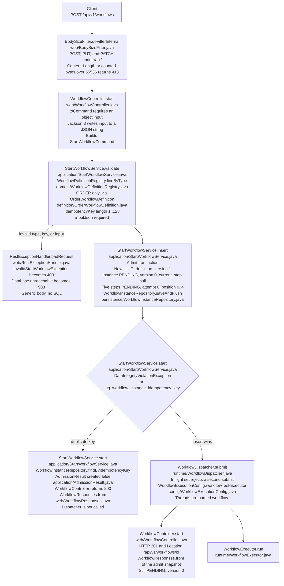
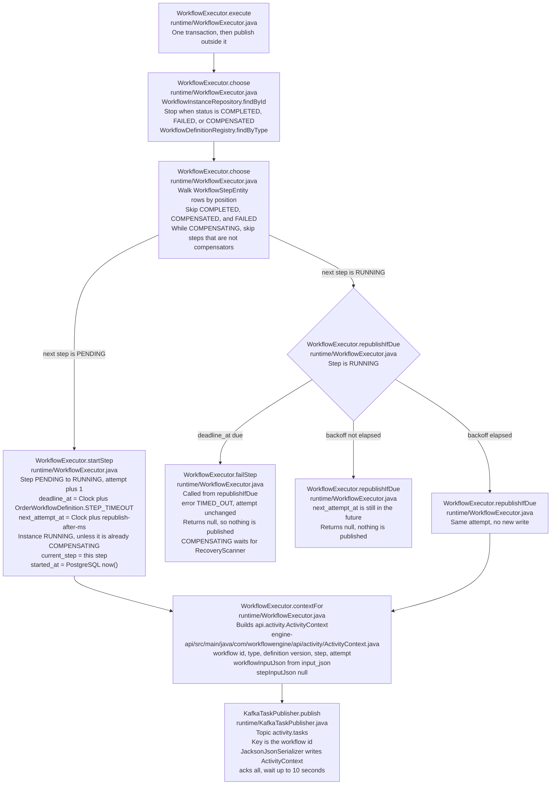
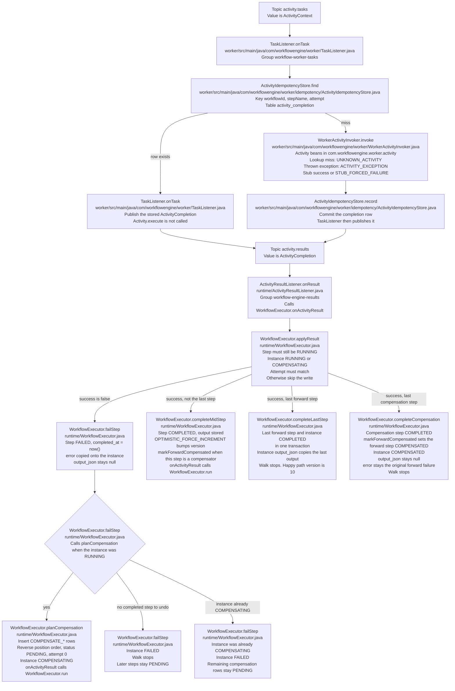
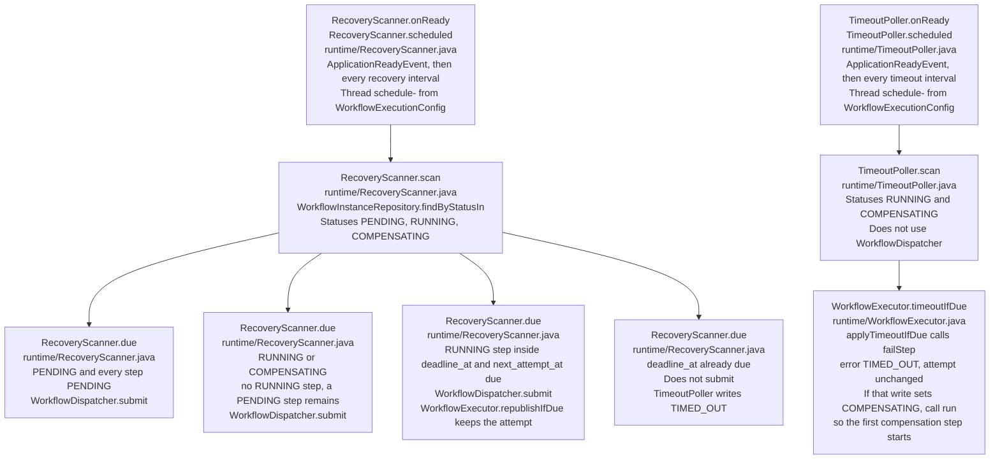
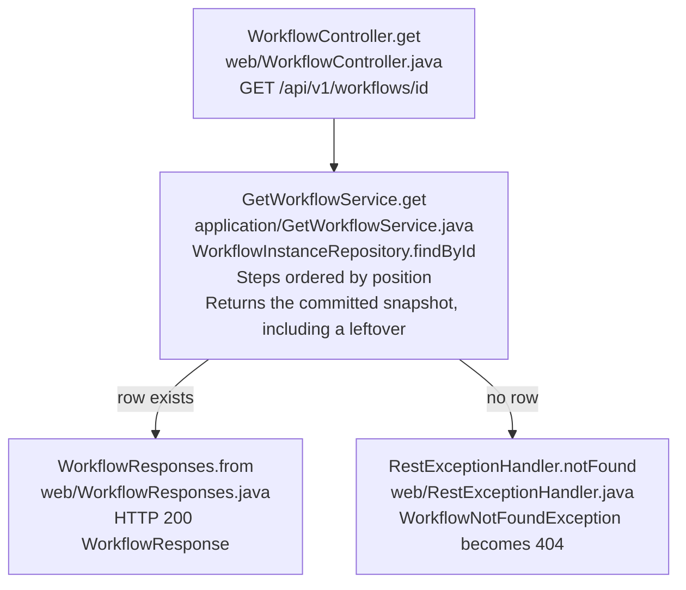

# Engine code flow

The `engine` module is the Spring Boot process that admits an ORDER workflow and moves it forward one committed Postgres transaction at a time. This page follows a start request through the classes that handle it.

Keep this file in the same change as the code it draws. When a class in the table below changes its thread, transaction, status write, publish, or the next class it calls, update the matching diagram and the table row. That includes the worker classes drawn on the result path (`TaskListener`, `ActivityIdempotencyStore`, `WorkerActivityInvoker`). `AGENTS.md` requires the update. A diagram that no longer matches the code is a bug.

A client posts to `POST /api/v1/workflows`. The request thread commits the instance as `PENDING` and returns. A `workflow-*` thread then starts one step and publishes `ActivityContext` on `activity.tasks`. The worker runs the activity. The engine applies `ActivityCompletion` from `activity.results` and either starts the next step, compensates, or stops.

Postgres is the source of truth. Each transition commits before the next publish. The happy path ends at instance `COMPLETED` with `version` 10. `GET /api/v1/workflows/{id}` is how a client sees that progress. The `201` body is the admit snapshot and stays `PENDING` / `version` 0.

## Admit the request

`BodySizeFilter` runs first on the Tomcat thread. `WorkflowController` turns the JSON body into a `StartWorkflowCommand`. `StartWorkflowService` validates it, inserts the rows, and only the insert winner calls `WorkflowDispatcher`.

`OrderWorkflowDefinition` supplies the five forward steps and their compensators: `CREATE_ORDER`, `RESERVE_INVENTORY`, `PROCESS_PAYMENT`, `CREATE_SHIPMENT`, `SEND_NOTIFICATION`, each with a `COMPENSATE_*` activity and a 5-minute `STEP_TIMEOUT`. Admission copies only the forward names. Compensation rows appear later, after a forward failure.

`RestExceptionHandler` also maps an unknown id to `404` and a body over 64 KB that surfaces during JSON parse to `413`.

## Publish one task

`WorkflowExecutor.run` catches an infrastructure failure, logs it with `workflowId`, and returns. It does not mark the step `FAILED`. `execute` commits the choice, then `KafkaTaskPublisher` sends the task. The publish waits for the broker ack, up to 10 seconds, and does not wait for the worker.

The first step-start is the transaction that moves the instance from `PENDING` to `RUNNING`. Later step-starts leave the instance `RUNNING` and move `current_step`. Every committed change of the instance row bumps JPA `@Version`. Hibernate is the only writer of `version`.

## Apply the worker result

The worker is a separate process. It is on this path because the engine's next class runs only after that result arrives. `ActivityResultListener` uses consumer group `workflow-engine-results`.

`failStep` returns without writing when the step is no longer `RUNNING`. A timeout that committed first keeps `TIMED_OUT`. The late success or failure is discarded, and the walk does not continue.

A forward failure of `CREATE_ORDER` has no completed step to undo, so the instance stays `FAILED` at `version` 2. A failure of `PROCESS_PAYMENT` after two completed steps inserts `COMPENSATE_RESERVE_INVENTORY` and `COMPENSATE_CREATE_ORDER`, ends `COMPENSATED`, and reaches `version` 10. While `COMPENSATING`, `choose` does not start `CREATE_SHIPMENT` or `SEND_NOTIFICATION`.

## Resume a leftover, and time out a step

These classes do not run on the POST thread. They call the same executor after the request has returned, or after a restart.

`WorkflowDispatcher` keeps an in-memory inflight set so the scanner does not start a second `run` while this process is already inside one. After a crash the set is empty, and the next scan submits the leftover. `FAILED`, `COMPLETED`, and `COMPENSATED` are terminal. The scanner does not select them, and an idempotent `POST` does not submit them either.

`GET` is separate from this loop.

## Classes

Engine paths are under `engine/src/main/java/com/workflowengine/`. Worker and `engine-api` rows use their full path. Each diagram block starts with `Class.method` and names that file.

| Class | Source | Thread | What it does on this path |
|---|---|---|---|
| `BodySizeFilter` | `web/BodySizeFilter.java` | HTTP | Rejects an `/api/` body over 64 KB with 413. |
| `WorkflowController` | `web/WorkflowController.java` | HTTP | Admits on POST and loads a snapshot on GET. |
| `WorkflowResponses` | `web/WorkflowResponses.java` | HTTP | Turns a snapshot into the JSON body. |
| `RestExceptionHandler` | `web/RestExceptionHandler.java` | HTTP | Generic 400, 404, 413, 503, and 500 bodies. |
| `StartWorkflowService` | `application/StartWorkflowService.java` | HTTP | Validates, commits the admit transaction, submits only the insert winner. |
| `AdmissionResult` | `application/AdmissionResult.java` | HTTP | `created` true is the 201 path. `created` false is the 200 path. |
| `GetWorkflowService` | `application/GetWorkflowService.java` | HTTP | Returns the committed snapshot for GET. |
| `WorkflowDefinitionRegistry` | `domain/WorkflowDefinitionRegistry.java` | any | Maps `ORDER` to `OrderWorkflowDefinition`. |
| `OrderWorkflowDefinition` | `definition/OrderWorkflowDefinition.java` | any | Five forward steps, each with a compensator and a 5-minute timeout. |
| `WorkflowInstanceRepository` | `persistence/WorkflowInstanceRepository.java` | any | Loads and inserts the instance and its steps. |
| `WorkflowExecutionConfig` | `config/WorkflowExecutionConfig.java` | startup | Builds the `workflow-` pool and the `schedule-` thread. |
| `WorkflowDispatcher` | `runtime/WorkflowDispatcher.java` | HTTP or `schedule-` | One inflight `run` per id on `workflowTaskExecutor`. |
| `WorkflowExecutor` | `runtime/WorkflowExecutor.java` | `workflow-*`, result listener, or `schedule-` | `choose`, `startStep`, `republishIfDue`, `applyResult`, `failStep`, `planCompensation`, `completeMidStep`, `completeLastStep`, `completeCompensation`, `timeoutIfDue`. |
| `KafkaTaskPublisher` | `runtime/KafkaTaskPublisher.java` | `workflow-*` | Sends `ActivityContext` after the step-start commit. |
| `ActivityResultListener` | `runtime/ActivityResultListener.java` | Kafka listener | Delivers `ActivityCompletion` to `onActivityResult`. |
| `RecoveryScanner` | `runtime/RecoveryScanner.java` | `schedule-` | `scan` and `due` submit a never-started admit or a due running step. |
| `TimeoutPoller` | `runtime/TimeoutPoller.java` | `schedule-` | `scan` asks `timeoutIfDue` to fail a due `RUNNING` step with `TIMED_OUT`. |
| `TaskListener` | `worker/src/main/java/com/workflowengine/worker/TaskListener.java` | worker listener | Consumes a task, skips a stored attempt, publishes `ActivityCompletion`. |
| `ActivityIdempotencyStore` | `worker/src/main/java/com/workflowengine/worker/idempotency/ActivityIdempotencyStore.java` | worker listener | `find` and `record` on `activity_completion`. |
| `WorkerActivityInvoker` | `worker/src/main/java/com/workflowengine/worker/WorkerActivityInvoker.java` | worker listener | Looks up the `Activity` bean and calls `execute`. |
| `ActivityContext` | `engine-api/src/main/java/com/workflowengine/api/activity/ActivityContext.java` | Kafka | Task record. JSON inside it stays text. |
| `ActivityCompletion` | `engine-api/src/main/java/com/workflowengine/api/activity/ActivityCompletion.java` | Kafka | Result record. |
